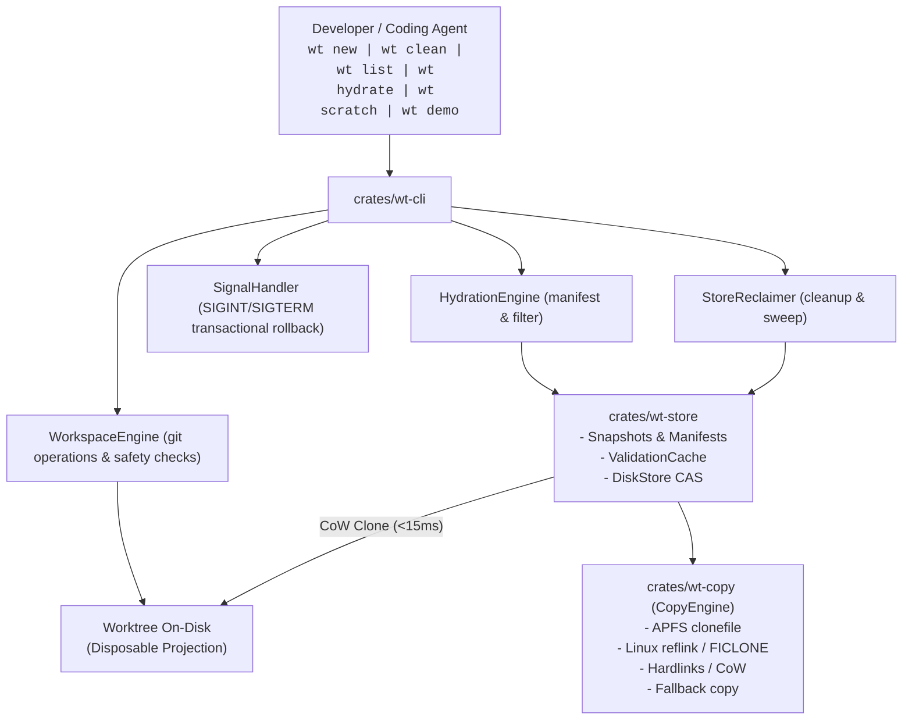

# Whole-Repository Architecture & Ponytail Audit Report

## Executive Summary

`wt-hydrate` (with optional `wt` alias) provides instant Git worktrees with heavy untracked directories hydrated in milliseconds. It achieves sub-second hydration by treating the content-addressed store as a local snapshot cache and checked-out directories as disposable Copy-on-Write projections.

Following the completion and verification of the **v0.1.0 Launch Readiness & Safety Remediation** milestone (PR #6), this audit performed a comprehensive whole-repository ponytail scan across `crates/wt-copy`, `crates/wt-store`, `crates/wt-cli`, benchmarks, test suites, CI workflows, and distribution packaging.

We verified the architecture against current code, audited all 84 source files, cataloged completed safety fixes, and identified high-impact opportunities for post-v0.1 simplification.

---

## Principles That Shaped Decisions

1. **`principle-laziness-protocol`**. Delete dead code and speculative wrappers rather than maintaining pre-v0.1 shims.
2. **`principle-subtract-before-you-add`**. Cut redundant single-caller forwarders, zero-sized wrapper types, and speculative safety gates.
3. **`principle-minimize-reader-load`**. Eliminate hand-rolled standard library routines in favor of Rust standard library features (`u32::from_le_bytes`, `Path::ancestors`, `std::io::copy`, `derive(Default)`).
4. **`principle-guard-the-context-window`**. Audit each subsystem in isolated parallel sweeps without context compaction.
5. **`principle-prove-it-works`**. Verify that all workspace targets compile with 0 warnings under `-D warnings` and pass all 133+ unit and integration tests.

---

## 1. Where We Started vs Where We Are Now

### Evolutionary Narrative

1. **Foundational V1 (Instant Worktrees)**: Started with SHA-256 CAS object store and read-only hardlinks. Garbage collection depended on individual refcount files in `refs/<hex>`.
2. **Fast Hydration & CoW Materialization**: Replaced read-only hardlinks with Copy-on-Write clones via APFS `fclonefileat(2)`. Added `ValidationCache` to bypass re-hashing unchanged files.
3. **Whole-Directory Snapshots & Store-Local Mark-and-Sweep GC ([ADR-0004](docs/adr/0004-mark-and-sweep-gc.md) & [ADR-0005](docs/adr/0005-directory-snapshots.md))**: Introduced atomic store-local TSV mirrors (`StoreMirror`) and whole-directory snapshots (`snapshots/<hash>/tree/`) projected via a single `clonefile(2)` syscall.
4. **V2 Incremental Diff Rebuilds ([ADR-0006](docs/adr/0006-external-library-evaluation.md))**: Added flat manifest diffing (`SnapshotDiff`) and macOS `getattrlistbulk(2)` batch walking in `bulkwalk.rs`.
5. **v0.1.0 Launch Readiness & Safety Hardening**: 
   - Strict `clean` safety contract with porcelain status verification and `--force` requirements.
   - CAS lease sweep refcount deduplication (`BTreeSet<ContentId>`) and inode permission protection.
   - Lockfile fast-path nested staleness stat validation (`is_nested_stale`).
   - Linux `copy_file_range` short write handling, `EINTR` retry loops, and Btrfs subvolume reflink support.
   - `SIGINT`/`SIGTERM` signal handlers and `CreateGuard` transactional rollback.
   - Python virtualenv `.pth` rewriting and binary byte-shebang support.
   - Release archive normalization (`wt-v<version>-<target>.tar.gz`).
   - Standalone `hydrate <path>` command, `init` starter command, in-memory defaults on `new`, and canonical renaming to `wt-hydrate` with `wt` alias.

---

## 2. Key Architectural Decisions & Tradeoffs

| Architectural Decision | Chosen Approach | Rejected Alternative | Core Rationale |
| :--- | :--- | :--- | :--- |
| **Storage Architecture** | Userspace content-addressed store (`~/.cache/wt/store`) | Virtual Filesystem (FUSE, NFS, kexts) | Userspace store avoids kext signing, kernel panics, and syscall interception overhead ([ADR-0001](docs/adr/0001-store-is-truth-tree-is-a-projection.md)). |
| **Core Product Scope** | Tool-agnostic worktree hydration primitive | Package manager / Build cache | Accelerates ignored directory hydration without re-implementing dependency resolvers ([ADR-0002](docs/adr/0002-tool-agnostic-worktree-hydration-first.md)). |
| **Language & Runtime** | Rust single static binary (`wt-hydrate` / `wt`) | Go, C++, Python daemon | Single static binary installable via curl or brew. Direct C-FFI to APFS `clonefile` and `getattrlistbulk` ([ADR-0003](docs/adr/0003-rust-single-binary-explicit-first.md)). |
| **Process Model** | Explicit, stateless CLI commands | Long-running background daemon | Explicit commands avoid state desynchronization and background daemon crashes ([ADR-0003](docs/adr/0003-rust-single-binary-explicit-first.md)). |
| **Hydration Primitive** | 1-syscall whole-directory `clonefile(2)` | Per-file reflink loop / hardlinks | Directory cloning completes in <15ms for 10,000+ files on APFS ([ADR-0005](docs/adr/0005-directory-snapshots.md)). |
| **GC Roots Architecture** | Store-local TSV mirror files (`<store>/worktrees/<key>.tsv`) | Per-blob refcount files | Store mirrors enable O(1) atomic publication per create ([ADR-0004](docs/adr/0004-mark-and-sweep-gc.md)). |
| **Snapshot Diff Rebuilds** | Flat sorted manifest diff + whole-tree clone + delta | Hierarchical Merkle trees | Flat diffs run in milliseconds with zero catalog lookup overhead. |
| **GC Safety Contract** | 15-minute grace period (`WT_GC_GRACE`) + mark-and-sweep | Immediate deletion / Hardlink-count GC | Protects in-flight worktrees and prevents data loss on interrupted creates. |

---

## 3. Subsystem Architecture Map

### 3.1 `crates/wt-copy` (Placement & Copy Backends)

| Component | Responsibility |
| :--- | :--- |
| `CopyBackend` Trait | Directory copy interface & safety classifications (`crates/wt-copy/src/lib.rs`). |
| `ClonefileBackend` | macOS APFS `libc::clonefile(2)` backend (`crates/wt-copy/src/clonefile.rs`). |
| `ReflinkBackend` | Linux Btrfs/XFS `ioctl(FICLONE)` backend (`crates/wt-copy/src/reflink.rs`). |
| `CopyFileRangeBackend` | Linux `copy_file_range(2)` with `EINTR` retries & short write handling (`crates/wt-copy/src/copy_file_range.rs`). |
| `HardlinkBackend` | POSIX hardlinks with write bit stripping (`crates/wt-copy/src/hardlink.rs`). |
| `DeepCopyBackend` | Fallback buffered standard byte copy backend (`crates/wt-copy/src/deep_copy.rs`). |
| `select_backend` | Dynamic backend selection based on filesystem capability probes (`crates/wt-copy/src/selection.rs`). |
| `Materializer` | Per-file placement engine with cross-device detection (`crates/wt-copy/src/materialize.rs`). |
| `CopyEngine` | High-level coordinator for directory copying and file materialization (`crates/wt-copy/src/engine.rs`). |

### 3.2 `crates/wt-store` (Object Store, Snapshots & GC)

| Component | Responsibility |
| :--- | :--- |
| `DiskStore` | 256-shard content-addressed store (`objects/xx/yyyy...`) (`crates/wt-store/src/disk.rs`). |
| `durable_write` | Crash-durable write protocol (`crates/wt-store/src/fsutil.rs`). |
| `bulk_walk_tree` | macOS `getattrlistbulk(2)` batch directory walker (`crates/wt-store/src/bulkwalk.rs`). |
| `ingest_tree` | Tree scanning & blob CAS storage with validation caching (`crates/wt-store/src/ingest.rs`). |
| `find_lockfile` | Multi-ecosystem lockfile discovery (`crates/wt-store/src/lockfile.rs`). |
| `VerifiedLedger` | Verified blob ledger cache (`verified.tsv`) (`crates/wt-store/src/verified.rs`). |
| `ValidationCache` | Ingest stat cache (`ingest-cache.tsv`) mapping `path -> (size, mtime, ContentId)` (`crates/wt-store/src/validation.rs`). |
| `Manifest` | Manifest parser & file mode normalizer (`crates/wt-store/src/snapshot/manifest.rs`). |
| `build_tree` | Snapshot tree builder using `DirFd` and `linkat` with inode protection (`crates/wt-store/src/snapshot/tree.rs`). |
| `publish_snapshot` | Atomic snapshot publication protocol with `.complete` token (`crates/wt-store/src/snapshot/publish.rs`). |
| `SnapshotProjectionEngine` | Lockfile fast path with bulkwalk nested mtime validation (`crates/wt-store/src/snapshot/projection.rs`). |
| `SnapshotDiff` | O(N) merge diff for v2 incremental cloning (`crates/wt-store/src/snapdiff.rs`). |
| `SelectionIndex` / `SnapshotLru` | Lockfile index (`index.tsv`), LRU tracker (`lru.tsv`), and WAL journal (`journal.tsv`) (`crates/wt-store/src/snapindex.rs`). |
| `StoreMirror` | Store-local worktree GC root records (`<store>/worktrees/<key>.tsv`) (`crates/wt-store/src/mirror.rs`). |
| `WorktreeLease` | Ephemeral lease management with process start-time verification (`crates/wt-store/src/lease.rs`). |
| `StoreReclaimer` / `sweep` | Deduplicated lease sweep & mark-and-sweep reclamation (`crates/wt-store/src/gc.rs`). |
| `DiskStore::scrub` | Sharded parallel blob and snapshot integrity verification (`crates/wt-store/src/scrub.rs`). |
| `DiskStore::hydrate` | Unified store hydration entry point (`crates/wt-store/src/hydrate.rs`). |

### 3.3 `crates/wt-cli` (CLI Interface & Presentation)

| Component | Responsibility |
| :--- | :--- |
| `WorkspaceEngine` | Git CLI wrapper, porcelain parser, and merge ancestry checks (`crates/wt-cli/src/workspace.rs`). |
| `RunConfig` | Unified environment policy parser with case-insensitive booleans (`crates/wt-cli/src/config.rs`). |
| `HydrationFilter` | `.wtinclude` pattern matcher & volatile compiler cache excluder (`crates/wt-cli/src/hydration_filter.rs`). |
| `relocate_toolchains` | Python virtualenv `.pth` rewrites, byte-shebang parsing, cycle detection (`crates/wt-cli/src/toolchain.rs`). |
| `signal` | Dedicated `SIGINT`/`SIGTERM` handler thread for ephemeral lease and sandbox cleanup (`crates/wt-cli/src/signal.rs`). |
| `Envelope` | Version 1 NDJSON envelope schema for agent workflows (`crates/wt-cli/src/envelope.rs`). |
| `create::run` | Transactional worktree creation with `CreateGuard` rollback (`crates/wt-cli/src/commands/create.rs`). |
| `clean::run` | Worktree cleanup with porcelain status checks and truthful receipts (`crates/wt-cli/src/commands/clean.rs`). |
| `hydrate::run` | Standalone hydration of pre-existing worktrees (`crates/wt-cli/src/commands/hydrate.rs`). |
| `init::run` | Explicit starter `.wtinclude` manifest generation (`crates/wt-cli/src/commands/init.rs`). |
| `list::run` | Worktree discovery and disk savings reporting labeled as estimated logical reuse (`crates/wt-cli/src/commands/list.rs`). |
| `scratch::run` | Ephemeral sandboxes with process monitoring (`crates/wt-cli/src/commands/scratch.rs`). |
| `scrub::run` | Store corruption verification command (`crates/wt-cli/src/commands/scrub.rs`). |
| `demo::run` | Performance test drive benchmark (`crates/wt-cli/src/commands/demo.rs`). |

---

## 4. Ranked Ponytail Audit Findings

Ranked by potential line savings.

### Crate: `crates/wt-store` (-688 lines)

1. `shrink:` Duplicate snapshot verification logic in `verify_snapshot_dir`. Reuse `DiskStore::find_snapshot` and `paranoid_verify_tree`. [`crates/wt-store/src/scrub.rs:81-159`](crates/wt-store/src/scrub.rs) **[-60 lines]**
2. `shrink:` Duplicate entry ingestion logic between macOS `getattrlistbulk` loop and portable walk. Extract shared `ingest_entry` helper. [`crates/wt-store/src/ingest.rs:110-181, 219-282`](crates/wt-store/src/ingest.rs) **[-60 lines]**
3. `shrink:` Combinatorial `publish_snapshot_*` boilerplate wrapper methods (8 public variants). Consolidate into options struct. [`crates/wt-store/src/snapshot/publish.rs:161-209, 285-334`](crates/wt-store/src/snapshot/publish.rs) **[-45 lines]**
4. `shrink:` Hand-rolled parallel scoped threadpool in `hydrate()` fallback. Reuse `wt_copy` copy batching / parallel dispatcher. [`crates/wt-store/src/hydrate.rs:178-260`](crates/wt-store/src/hydrate.rs) **[-45 lines]**
5. `delete:` Legacy refcount `DiskStore::sweep` and `Swept` struct. Mark-and-sweep `StoreReclaimer` is the sole GC engine. [`crates/wt-store/src/disk.rs:134-140, 399-436`](crates/wt-store/src/disk.rs) **[-44 lines]**
6. `shrink:` Duplicate entry placement logic between `place_entry` and `place_entry_relative`. Unify placement helper with optional directory fd. [`crates/wt-store/src/snapshot/tree.rs:401-508, 521-617`](crates/wt-store/src/snapshot/tree.rs) **[-40 lines]**
7. `yagni:` Single-implementation `WorkspaceCleaner` trait. Use dynamic dispatch or function pointer without generic trait parameter. [`crates/wt-store/src/gc.rs:629-665`](crates/wt-store/src/gc.rs) **[-37 lines]**
8. `delete:` Redundant `MetadataLock` RAII flock struct. Use unified flock helper in `fsutil.rs`. [`crates/wt-store/src/snapindex.rs:523-559`](crates/wt-store/src/snapindex.rs) **[-37 lines]**
9. `yagni:` Single-implementation `Store` trait and `impl Store for DiskStore`. Move methods directly onto `DiskStore`. [`crates/wt-store/src/lib.rs:159-180, crates/wt-store/src/disk.rs:459-588`](crates/wt-store/src/lib.rs) **[-35 lines]**
10. `shrink:` Duplicate serialization and stat parsing logic between `ValidationCache` and `VerifiedLedger`. Use shared TSV codec. [`crates/wt-store/src/validation.rs:110-169, crates/wt-store/src/verified.rs:123-179`](crates/wt-store/src/validation.rs) **[-30 lines]**
11. `delete:` Redundant `audit_marks_against_refs` legacy transition audit code. [`crates/wt-store/src/gc.rs:488-514`](crates/wt-store/src/gc.rs) **[-27 lines]**
12. `shrink:` Duplicate `wt-hydrated.tsv` line parsing in `sweep_leases` and `retire_worktree`. Shared `parse_hydrated_ledger` helper. [`crates/wt-store/src/gc.rs:772-791, 911-936`](crates/wt-store/src/gc.rs) **[-25 lines]**
13. `delete:` Redundant `RefsDirLock` and `lock_refs` duplicating `RefsLock` in `disk.rs`. Unified `RefsLock` in `fsutil.rs`. [`crates/wt-store/src/scrub.rs:41-63`](crates/wt-store/src/scrub.rs) **[-23 lines]**
14. `stdlib:` Hand-rolled little-endian integer readers `read_u32`, `read_i32`, `read_u64`, `read_i64`. Use `u32::from_le_bytes`, `u64::from_le_bytes`. [`crates/wt-store/src/bulkwalk.rs:456-489`](crates/wt-store/src/bulkwalk.rs) **[-20 lines]**
15. `shrink:` Duplicate torn-tail line stripping logic across `SelectionIndex::load_canonical`, `SnapshotLru::load_canonical`, and `compact_journal`. Shared `trim_complete_lines` helper. [`crates/wt-store/src/snapindex.rs:149-155, 354-360, 586-594`](crates/wt-store/src/snapindex.rs) **[-18 lines]**
16. `shrink:` Verbose line-by-line string assembly in `StoreMirror::serialize`. [`crates/wt-store/src/mirror.rs:147-173`](crates/wt-store/src/mirror.rs) **[-14 lines]**
17. `delete:` Duplicate `collect_tree_rels` helper. Reuse `collect_rels` from `snapshot/tree.rs`. [`crates/wt-store/src/scrub.rs:66-78`](crates/wt-store/src/scrub.rs) **[-13 lines]**
18. `stdlib:` Hand-rolled directory ancestor loop in `find_lockfile`. Use `std::path::Path::ancestors`. [`crates/wt-store/src/lockfile.rs:40-56`](crates/wt-store/src/lockfile.rs) **[-12 lines]**
19. `shrink:` Redundant disk stat total size recomputation in `stage_and_publish`. Reuse precomputed size. [`crates/wt-store/src/snapshot/publish.rs:501-512`](crates/wt-store/src/snapshot/publish.rs) **[-12 lines]**
20. `shrink:` Manual chunking and char conversion in `ContentId::from_hex`. Concise chunk parser. [`crates/wt-store/src/lib.rs:76-100`](crates/wt-store/src/lib.rs) **[-12 lines]**
21. `shrink:` Verbose string-building in `WorktreeLease::serialize`. Single `format!` call. [`crates/wt-store/src/lease.rs:63-77`](crates/wt-store/src/lease.rs) **[-11 lines]**
22. `delete:` Dead `DiskStore::link_out` method. Superseded by `wt_copy::Materializer`. [`crates/wt-store/src/disk.rs:448-456`](crates/wt-store/src/disk.rs) **[-9 lines]**
23. `shrink:` Redundant `rel_text` calls per entry in `ingest_tree_walk`. Compute `rel` once per iteration. [`crates/wt-store/src/ingest.rs:221-257`](crates/wt-store/src/ingest.rs) **[-8 lines]**
24. `shrink:` Duplicate commit fragment cleaning in `check_git_line`. [`crates/wt-store/src/lockfile.rs:127-133, 143-149`](crates/wt-store/src/lockfile.rs) **[-8 lines]**
25. `shrink:` Duplicate distinct blob set collection & `add_ref` loop. [`crates/wt-store/src/hydrate.rs:118-122, 287-292`](crates/wt-store/src/hydrate.rs) **[-8 lines]**
26. `delete:` Unused `ValidationCache::len` and `ValidationCache::is_empty`. [`crates/wt-store/src/validation.rs:93-100`](crates/wt-store/src/validation.rs) **[-8 lines]**
27. `shrink:` Allocation-heavy string vector join in `SelectionRecord::serialize`. [`crates/wt-store/src/snapindex.rs:75-80`](crates/wt-store/src/snapindex.rs) **[-6 lines]**
28. `delete:` Redundant pass-through wrappers `SelectionIndex::save` and `SnapshotLru::save`. Call `save_durable` directly. [`crates/wt-store/src/snapindex.rs:215-217, 405-407`](crates/wt-store/src/snapindex.rs) **[-6 lines]**
29. `stdlib:` Hand-rolled parent/filename splitter in `split_parent_and_filename`. Use `str::rsplit_once('/')`. [`crates/wt-store/src/snapshot/tree.rs:203-210`](crates/wt-store/src/snapshot/tree.rs) **[-6 lines]**
30. `shrink:` String allocation per file/dir in `resolve_dest_path`. [`crates/wt-store/src/hydrate.rs:334-340`](crates/wt-store/src/hydrate.rs) **[-5 lines]**
31. `shrink:` Redundant `lease_path` scratch prefix formatting. Inline formatting. [`crates/wt-store/src/lease.rs:116-123`](crates/wt-store/src/lease.rs) **[-4 lines]**
32. `shrink:` Heap allocation for hex decoding in `unescape`. Use `char::to_digit(16)`. [`crates/wt-store/src/mirror.rs:82-84`](crates/wt-store/src/mirror.rs) **[-4 lines]**

---

### Crate: `crates/wt-cli` (-604 lines, -1 dependency)

1. `delete:` Unused `HydrationFilter` struct wrapper, its 8 methods, and unit tests. Free functions `load_patterns` and `collect_matches` are used directly. [`crates/wt-cli/src/hydration_filter.rs:89-160, 511-531`](crates/wt-cli/src/hydration_filter.rs) **[-94 lines]**
2. `shrink:` Hand-rolled multi-threaded 10,000-file synthetic fixture generator in `generate_synthetic_fixture`. Replace with concise loop writing templates without manual chunked thread dispatch. [`crates/wt-cli/src/commands/demo.rs:88-241`](crates/wt-cli/src/commands/demo.rs) **[-85 lines]**
3. `yagni:` Duplicated CLI subcommand enum variants `New`, `Isolate`, and `TestDrive` and duplicate dispatch arms. Use clap's `#[command(alias = "...")]` attributes. [`crates/wt-cli/src/cli.rs:35-49`, `crates/wt-cli/src/commands/mod.rs:60-71`](crates/wt-cli/src/cli.rs) **[-55 lines]**
4. `native:` Hand-rolled multi-threaded scoped chunked recursive copy engine (`recursive_copy` + `copy_subtree`) in benchmark demo. Replace with standard recursive directory copy. [`crates/wt-cli/src/commands/demo.rs:18-86`](crates/wt-cli/src/commands/demo.rs) **[-45 lines]**
5. `shrink:` Repetitive JSON envelope serialization boilerplate across 10 dispatch arms in `commands/mod.rs`. Extract `emit_json` helper. [`crates/wt-cli/src/commands/mod.rs:25-200`](crates/wt-cli/src/commands/mod.rs) **[-45 lines]**
6. `yagni:` Manual `guard.rollback(); return Err(e)` in match blocks and redundant `CreateGuard::rollback` defeating RAII. Rely on `CreateGuard::drop` and standard `?` operator. [`crates/wt-cli/src/commands/create.rs:45-53, 116-159`](crates/wt-cli/src/commands/create.rs) **[-40 lines]**
7. `shrink:` Four duplicated 10-line manual struct initializations of empty `CleanData`. Derive `Default` on `CleanData` and call `CleanData::default()`. [`crates/wt-cli/src/commands/clean.rs:160-301`](crates/wt-cli/src/commands/clean.rs) **[-36 lines]**
8. `shrink:` Duplicated iteration and calculation computing blob sizes and root directories across sidecars and mirrors in `wt list`. Extract shared helper. [`crates/wt-cli/src/commands/list.rs:118-179`](crates/wt-cli/src/commands/list.rs) **[-35 lines]**
9. `delete:` Duplicate unit test `test_is_volatile_cache` in `toolchain.rs` copied verbatim from `hydration_filter.rs`. [`crates/wt-cli/src/toolchain.rs:317-339`](crates/wt-cli/src/toolchain.rs) **[-22 lines]**
10. `yagni:` Redundant one-line wrapper functions `pub fn run` delegating to private functions `create`, `hydrate`, and `init`. [`crates/wt-cli/src/commands/create.rs:18-26`, `crates/wt-cli/src/commands/hydrate.rs:14-21`, `crates/wt-cli/src/commands/init.rs:11-18`](crates/wt-cli/src/commands/create.rs) **[-21 lines]**
11. `shrink:` Duplicated 15-line `ScratchData` struct construction between bare scratch and executed scratch branches. [`crates/wt-cli/src/commands/scratch.rs:204-265`](crates/wt-cli/src/commands/scratch.rs) **[-20 lines]**
12. `shrink:` Duplicated mirror reading and commit resolution between `check_base_movement` and `check_worktree_base_movement`. [`crates/wt-cli/src/base.rs:18-33`](crates/wt-cli/src/base.rs) **[-15 lines]**
13. `delete:` Unused dead methods `remove_worktree_lenient` and `remove_worktree` in `WorkspaceEngine`. [`crates/wt-cli/src/workspace.rs:380-394`](crates/wt-cli/src/workspace.rs) **[-15 lines]**
14. `stdlib:` Hand-rolled byte search and replace helper `replace_bytes`. Use slice replacement. [`crates/wt-cli/src/toolchain.rs:93-109`](crates/wt-cli/src/toolchain.rs) **[-12 lines]**
15. `shrink:` Repetitive condition `report.snapshot_dirs_scanned > 0 || !report.corrupt_snapshots.is_empty()` in `ScrubData`. Bind to `has_snapshots`. [`crates/wt-cli/src/commands/scrub.rs:70-90`](crates/wt-cli/src/commands/scrub.rs) **[-12 lines]**
16. `delete:` Trivial function aliases `parse`, `matches`, and `collect_matched_directories` in `hydration_filter.rs`. [`crates/wt-cli/src/hydration_filter.rs:191-309`](crates/wt-cli/src/hydration_filter.rs) **[-12 lines]**
17. `delete:` Forwarder module `crates/wt-cli/src/manifest.rs` re-exporting `hydration_filter::*`. [`crates/wt-cli/src/manifest.rs:1-11`](crates/wt-cli/src/manifest.rs) **[-11 lines]**
18. `native:` Over-engineered scratch ID generation using external crate `sha2` on timestamp + pid. Replace with standard library formatting (`format!("{:08x}", ...)`) and drop `sha2` from `wt-cli`. [`crates/wt-cli/src/commands/scratch.rs:22-35`, `crates/wt-cli/Cargo.toml:28`](crates/wt-cli/src/commands/scratch.rs) **[-10 lines, -1 dep]**
19. `delete:` Dead constructor `Diagnostic::info` marked `#[allow(dead_code)]`. [`crates/wt-cli/src/envelope.rs:35-42`](crates/wt-cli/src/envelope.rs) **[-8 lines]**
20. `delete:` Unused dead fields `snapshot_hashes`, `strategy`, and `total_copied` on `HydrationReport`. [`crates/wt-cli/src/hydrate.rs:52-65`](crates/wt-cli/src/hydrate.rs) **[-8 lines]**
21. `delete:` Trivial 3-line forwarder `is_volatile_cache` in `toolchain.rs`. Use direct `pub use`. [`crates/wt-cli/src/toolchain.rs:20-22`](crates/wt-cli/src/toolchain.rs) **[-3 lines]**

---

### Crate: `crates/wt-copy` (-259 lines)

1. `delete:` Dead `CopyEngine` batch & single-file materialization wrappers (`materialize_file`, `materialize_files`) and `BatchPlacementReceipt`. Callers use `Materializer` directly. [`crates/wt-copy/src/engine.rs:22-42, 137-184`](crates/wt-copy/src/engine.rs) **[-69 lines]**
2. `delete:` Speculative `Safety` enum, `Error::UnsafeBackend`, `CopyBackend::safety()`, `ensure_backend_runnable()`, and test backend `PendingBackend`. Every shipped backend is safe. [`crates/wt-copy/src/lib.rs:95-196`, `crates/wt-copy/src/copy_tree.rs:76-81`](crates/wt-copy/src/lib.rs) **[-65 lines]**
3. `shrink:` Verbose `Materializer::select` struct-construction boilerplate across target OS gates. Compute `(backend, strategy)` tuple and construct `Self` once. [`crates/wt-copy/src/materialize.rs:260-315`](crates/wt-copy/src/materialize.rs) **[-22 lines]**
4. `delete:` Dead `FileMaterialize::name(&self)` trait method and redundant struct implementations on `HardlinkOut`, `CloneOut`, `ReflinkOut`, and `CopyFileRangeOut`. [`crates/wt-copy/src/materialize.rs:36-160`](crates/wt-copy/src/materialize.rs) **[-15 lines]**
5. `shrink:` Strategy selection boilerplate and duplicate fallback match arms in `CopyEngine::copy_dir`. Combine identical fallback arms. [`crates/wt-copy/src/engine.rs:76-130`](crates/wt-copy/src/engine.rs) **[-15 lines]**
6. `yagni:` Redundant `Materializer::new` delegator and unused `Materializer::custom` constructor. [`crates/wt-copy/src/materialize.rs:228-238, 318-321`](crates/wt-copy/src/materialize.rs) **[-14 lines]**
7. `delete:` Duplicate `c_path` helper and hand-rolled `fstype_is` byte-scanner in `clonefile.rs`. Use `sys::c_path` and `sys::probe_fs_capabilities`. [`crates/wt-copy/src/clonefile.rs:59-70`](crates/wt-copy/src/clonefile.rs) **[-12 lines]**
8. `stdlib:` Hand-rolled 128 KiB heap buffer allocation and manual read/write loop in `buffered_copy_file`. Use `std::io::copy(&mut src, &mut dest)`. [`crates/wt-copy/src/sys.rs:92-101`](crates/wt-copy/src/sys.rs) **[-10 lines]**
9. `shrink:` Ancestor directory walk in `sys::find_existing_ancestor`. Use `while !path.exists() { path = path.parent().unwrap_or(Path::new(".")); }`. [`crates/wt-copy/src/sys.rs:112-128`](crates/wt-copy/src/sys.rs) **[-10 lines]**
10. `shrink:` Multiline error code matcher in `materialize::placement_refused`. Format as `matches!(e.raw_os_error(), Some(libc::EPERM | ...))`. [`crates/wt-copy/src/materialize.rs:175-186`](crates/wt-copy/src/materialize.rs) **[-9 lines]**
11. `shrink:` Verbose pattern matching in `sys::is_cross_device`. Use `let (Ok(src_dev), Ok(dest_dev)) = ... else { return false; };`. [`crates/wt-copy/src/sys.rs:147-161`](crates/wt-copy/src/sys.rs) **[-7 lines]**
12. `delete:` Dead `Materializer::for_directories` backwards-compatibility alias. [`crates/wt-copy/src/materialize.rs:248-251`](crates/wt-copy/src/materialize.rs) **[-4 lines]**
13. `shrink:` Double heap `String` allocation in macOS `fs_supports_hardlinks`. Match directly on `CStr` byte slice. [`crates/wt-copy/src/hardlink.rs:78-83`](crates/wt-copy/src/hardlink.rs) **[-4 lines]**
14. `shrink:` Verbose staging path calculation in `copy_tree::staging_path`. [`crates/wt-copy/src/copy_tree.rs:101-108`](crates/wt-copy/src/copy_tree.rs) **[-3 lines]**

---

### Packaging, Tests & Benchmarks (-1,875 lines)

1. `delete:` Legacy per-blob refcounting tests and refcount sweep tests in `store.rs`. Mark-and-sweep via TSV mirrors is the source of truth. [`crates/wt-store/tests/store.rs:101-509`](crates/wt-store/tests/store.rs) **[-408 lines]**
2. `delete:` Dead legacy refcount garbage collection integration test suite `gc.rs`. Mark-and-sweep GC is fully tested in `gc_mirror.rs`, `gc_snapshot_cap.rs`, and `lease_sweep.rs`. [`crates/wt-cli/tests/gc.rs:1-277`](crates/wt-cli/tests/gc.rs) **[-277 lines]**
3. `shrink:` 26 discrete integration test binaries in `crates/wt-cli/tests/`. Consolidate into 5 cohesive module targets (`commands.rs`, `snapshots.rs`, `gc.rs`, `storage.rs`, `presentation.rs`) to eliminate duplicate crate imports and Cargo link overhead. [`crates/wt-cli/tests/*.rs`](crates/wt-cli/tests) **[-220 lines]**
4. `yagni:` Duplicate `V2Fixture` definition in `snapshots_v2.rs`. Reuse shared `Fixture` in `common/mod.rs`. [`crates/wt-cli/tests/snapshots_v2.rs:36-126`](crates/wt-cli/tests/snapshots_v2.rs) **[-90 lines]**
5. `yagni:` Duplicate timing, disk usage, and stage log parsing functions in `run.sh`. Source shared functions from `eval_metrics.sh` and `eval_storage.sh`. [`benchmarks/run.sh:79-468`](benchmarks/run.sh) **[-81 lines]**
6. `delete:` Legacy pre-fidelity gap tolerance counters and symlink/mode tolerance checks in `run.sh`. [`benchmarks/run.sh:236-675`](benchmarks/run.sh) **[-73 lines]**
7. `yagni:` Duplicate `RichFixture` definition in `snapshots.rs`. Reuse shared `Fixture` in `common/mod.rs`. [`crates/wt-cli/tests/snapshots.rs:42-104`](crates/wt-cli/tests/snapshots.rs) **[-62 lines]**
8. `stdlib:` Duplicate `fn git` subprocess runner independently defined across 7 integration test files. Centralize in `common::git`. [`crates/wt-cli/tests/apfs_defaults.rs:56-64`, `branch_stacking.rs:14-23`, `clean.rs:53-61`, `lockfile_fastpath.rs:61-69`, `new.rs:53-61`, `snapshots.rs:105-113`, `snapshots_v2.rs:127-135`](crates/wt-cli/tests/apfs_defaults.rs) **[-62 lines]**
9. `yagni:` Duplicate `LockfileFixture` definition in `lockfile_fastpath.rs`. Reuse shared `Fixture`. [`crates/wt-cli/tests/lockfile_fastpath.rs:9-68`](crates/wt-cli/tests/lockfile_fastpath.rs) **[-60 lines]**
10. `yagni:` Duplicate `store_footprint` scanner and tree assertion helpers across `store_flow.rs` and `cache_flow.rs`. Move to `common/mod.rs`. [`crates/wt-cli/tests/store_flow.rs:19-56`, `cache_flow.rs:20-78`](crates/wt-cli/tests/store_flow.rs) **[-59 lines]**
11. `yagni:` Duplicate `TestFixture` definitions in `apfs_defaults.rs`, `clean.rs`, `new.rs`. Reuse shared `Fixture`. [`crates/wt-cli/tests/apfs_defaults.rs:13-54`, `clean.rs:11-51`, `new.rs:11-51`](crates/wt-cli/tests/apfs_defaults.rs) **[-151 lines]**
12. `yagni:` Duplicate clocks, stage parser, and tree verification in `v2-bench.sh`. [`benchmarks/v2-bench.sh:89-158`](benchmarks/v2-bench.sh) **[-46 lines]**
13. `delete:` Legacy sweep and store migration test cases in `json_output.rs`. [`crates/wt-cli/tests/json_output.rs:156-194`](crates/wt-cli/tests/json_output.rs) **[-39 lines]**
14. `yagni:` Duplicate `snapshot` and `hydrated_file` verification helpers across `hardlink_safety.rs` and `cow_materialization.rs`. [`crates/wt-cli/tests/hardlink_safety.rs:26-60`, `cow_materialization.rs:24-60`](crates/wt-cli/tests/hardlink_safety.rs) **[-34 lines]**
15. `stdlib:` Verbose hand-rolled shell completion directory search loops in `install.sh`. [`install.sh:109-154`](install.sh) **[-31 lines]**
16. `yagni:` Redundant 10,000-file benchmark synthesis in `demo.rs` to verify Clap `test-drive` alias. [`crates/wt-cli/tests/demo.rs:99-129`](crates/wt-cli/tests/demo.rs) **[-31 lines]**
17. `shrink:` Duplicated high-resolution clock and tree verification in `eval.sh`. [`benchmarks/eval.sh:164-191`](benchmarks/eval.sh) **[-28 lines]**
18. `yagni:` Duplicate Ubuntu test execution and redundant `cargo build` in `ci.yml`. [`.github/workflows/ci.yml:9-45`](.github/workflows/ci.yml) **[-18 lines]**
19. `shrink:` Repetitive target archive packaging loop in `smoke-install.sh`. [`scripts/smoke-install.sh:45-67`](scripts/smoke-install.sh) **[-12 lines]**
20. `stdlib:` Duplicated `sha256sum` vs `shasum` platform branching across `install.sh` and `smoke-install.sh`. [`install.sh:69-73`, `scripts/smoke-install.sh:60-64`](install.sh) **[-10 lines]**
21. `shrink:` Standalone single-step `setup-version` job in `release.yml`. [`.github/workflows/release.yml:14-23`](.github/workflows/release.yml) **[-10 lines]**
22. `delete:` Dead shell completion generation loop in `release.yml`. [`.github/workflows/release.yml:76-78`](.github/workflows/release.yml) **[-8 lines]**
23. `stdlib:` Hand-rolled sha256 checksum platform branching in `chaos.sh`. [`benchmarks/chaos.sh:73-77`](benchmarks/chaos.sh) **[-5 lines]**

---

## 5. Line Savings Summary

| Area | Scope | Line Savings | Notes |
| :--- | :--- | :--- | :--- |
| `crates/wt-store/src` | Storage, Snapshots & GC | **-688 lines** | Ingestion deduplication, snapshot wrapper consolidation, flock/mutex unification |
| `crates/wt-cli/src` | CLI, Commands & Presentation | **-604 lines, -1 dep** | Dead `HydrationFilter` struct, demo fixture generator, duplicate enum variants, `CleanData` derivation |
| `crates/wt-copy/src` | Placement & Copy Backends | **-259 lines** | Dead `CopyEngine` wrappers, speculative `Safety` gates, constructor consolidation |
| `crates/*/tests` | Integration Test Suites | **-1,570 lines** | Dead legacy refcount tests, 26 -> 5 binary consolidation, shared `Fixture` harnesses |
| `benchmarks/*` | Benchmark Suites | **-233 lines** | Monolithic `run.sh` duplication, legacy gap checks, shared metric parsers |
| Infrastructure & Scripts | CI, `install.sh`, `scripts` | **-72 lines** | Redundant CI steps, completion loops, checksum branches |
| **Total Net Reduction** | | **-3,426 lines, -1 dependency** | |

---

## 6. Launch-Readiness Assessment (v0.1.0)

### 🟢 Completed & Certified (v0.1.0 Launch Ready)
- [x] **Release Tarball Prefix Mismatch Fixed**: Normalized `.github/workflows/release.yml`, `install.sh`, and `scripts/gen-formula.sh` to `wt-v<version>-<target>.tar.gz`.
- [x] **`install.sh` Version Normalization**: Accepts both `0.1.0` and `v0.1.0`.
- [x] **Destructive Cleanup Prevention**: Enforced `--force` requirement for dirty worktrees and unmerged branches.
- [x] **Truthful Receipts & Non-Zero Exits**: Failures emit error diagnostics and exit code 1.
- [x] **CAS Lease Sweep Refcount Deduplication**: Deduplicated blob IDs in `BTreeSet<ContentId>` before refcount decrements.
- [x] **Lockfile Fast-Path Staleness Validation**: Bulk stat scan detects nested modifications even when lockfile is unchanged.
- [x] **Process Signal Handling & Transactional Rollbacks**: `SIGINT`/`SIGTERM` cleanup handlers and `CreateGuard` rollback on hydration failure.
- [x] **Python Toolchain Relocation**: Rewrote `.pth` files and binary byte-shebangs without UTF-8 crashes.
- [x] **Standalone Hydration & Product Renaming**: Added `wt-hydrate hydrate <path>` and `wt-hydrate init`, canonical binary `wt-hydrate` with `wt` alias.

### 🟡 Post-v0.1.0 Architecture Simplifications
- [ ] **Consolidate Integration Test Binaries**: Merge 26 test files in `crates/wt-cli/tests/` into 5 cohesive modules.
- [ ] **Remove Legacy `refs/` Directory Machinery**: Drop legacy refcount files after mark-and-sweep store migration is complete.
- [ ] **Simplify Snapshot WAL Journal**: Replace 3-layer WAL journal with locked atomic single-file index.
- [ ] **CI Regression Gating**: Wire `benchmarks/eval.sh --quick` into GitHub Actions.
