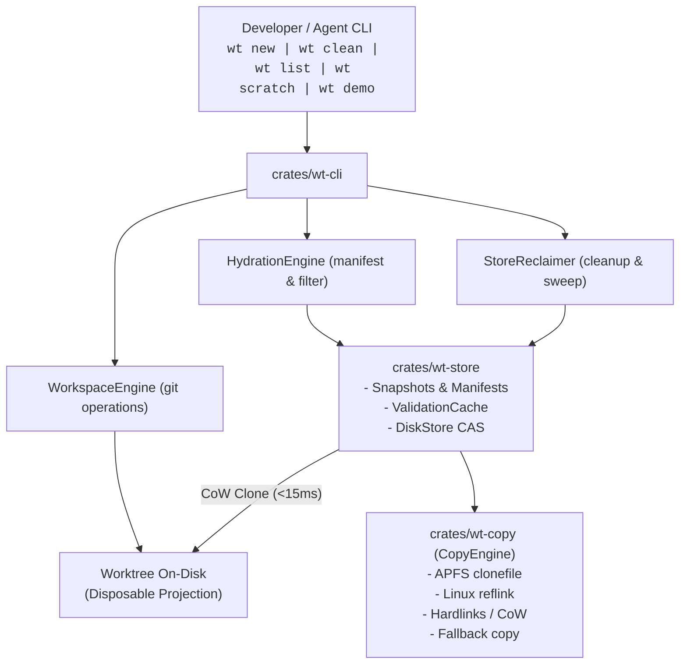

# Whole-Repository Architecture & Ponytail Audit Report

## Executive Summary

`wt` provides instant Git worktrees with heavy untracked directories hydrated in milliseconds. It achieves sub-second hydration by treating the content-addressed store as the source of truth and checked-out directories as disposable projections.

This audit reviewed the full codebase across `crates/wt-copy`, `crates/wt-store`, `crates/wt-cli`, benchmarks, test suites, and distribution packaging. We verified the architecture, traced historical evolution across 6 ADRs, identified over-engineering opportunities, and checked launch readiness for version 0.1.0.

`throughput checkpoint: n/a, read-only investigation`

---

## Principles That Shaped Decisions

1. **`principle-laziness-protocol`**. We targeted complete deletion of legacy refcount code ([`refs/`](file:///Users/sharzilnafis/Projects/dumps/idea1/crates/wt-store/src/disk.rs#L285-L316)) and deprecation forwarders ([`manifest.rs`](file:///Users/sharzilnafis/Projects/dumps/idea1/crates/wt-cli/src/manifest.rs)) instead of maintaining backward-compatibility shims before version 0.1.0.
2. **`principle-subtract-before-you-add`**. We prioritized cutting the three-layer WAL snapshot index ([`snapindex.rs`](file:///Users/sharzilnafis/Projects/dumps/idea1/crates/wt-store/src/snapindex.rs#L128-L233)) down to a single atomic TSV index before adding further storage features.
3. **`principle-minimize-reader-load`**. We identified single-caller delegators in [`CopyEngine`](file:///Users/sharzilnafis/Projects/dumps/idea1/crates/wt-copy/src/engine.rs#L137-L184) and [`WorkspaceEngine`](file:///Users/sharzilnafis/Projects/dumps/idea1/crates/wt-cli/src/workspace.rs#L33-L68) to collapse shallow wrappers into direct caller invocations.
4. **`principle-guard-the-context-window`**. We dispatched 6 parallel subagents across isolated architectural slices (`how`, `why`, and 4 `swarm` workers) to review 28,606 lines of Rust without context compaction.
5. **`principle-prove-it-works`**. We proved clean compilation and zero Clippy warnings across all workspace targets, while uncovering runtime bottlenecks in debug-mode test fixtures.

---

## 1. Where We Started vs Where We Are Now



### Evolutionary Narrative

1. **Foundational V1 (Instant Worktrees)**. Started with a SHA-256 CAS object store. Worktrees hydrated via read-only hardlinks. Garbage collection depended on individual refcount files in `refs/<hex>`. Creating a 4,000-file worktree required thousands of serialized disk writes and stripped file write permissions.
2. **Fast Hydration & CoW Materialization**. Replaced read-only hardlinks with Copy-on-Write clones via APFS `fclonefileat(2)`. Added [`ValidationCache`](file:///Users/sharzilnafis/Projects/dumps/idea1/crates/wt-store/src/validation.rs) to bypass re-hashing unchanged files by recording `(size, mtime, ContentId)`.
3. **Whole-Directory Snapshots & Store-Local Mark-and-Sweep GC ([ADR-0004](file:///Users/sharzilnafis/Projects/dumps/idea1/docs/adr/0004-mark-and-sweep-gc.md) & [ADR-0005](file:///Users/sharzilnafis/Projects/dumps/idea1/docs/adr/0005-directory-snapshots.md))**. Switched from per-blob refcounts to atomic store-local TSV mirrors ([`StoreMirror`](file:///Users/sharzilnafis/Projects/dumps/idea1/crates/wt-store/src/mirror.rs)). Introduced whole-directory snapshots (`snapshots/<hash>/tree/`) projected into worktrees via a single `clonefile(2)` syscall in under 15 milliseconds.
4. **V2 Incremental Diff Rebuilds ([ADR-0006](file:///Users/sharzilnafis/Projects/dumps/idea1/docs/adr/0006-external-library-evaluation.md))**. Replaced slow full rebuilds with flat sorted manifest diffing ([`SnapshotDiff`](file:///Users/sharzilnafis/Projects/dumps/idea1/crates/wt-store/src/snapdiff.rs)). Evaluated and rejected external dependencies (`snapdir`, `clonetree`). Adopted macOS `getattrlistbulk(2)` batch walking in [`bulkwalk.rs`](file:///Users/sharzilnafis/Projects/dumps/idea1/crates/wt-store/src/bulkwalk.rs).
5. **Agent Workflows, Sandboxes & 3-Verb Workflow**. Introduced version 1 NDJSON envelopes ([`Envelope`](file:///Users/sharzilnafis/Projects/dumps/idea1/crates/wt-cli/src/envelope.rs)), lease-backed scratch sandboxes ([`WorktreeLease`](file:///Users/sharzilnafis/Projects/dumps/idea1/crates/wt-store/src/lease.rs)), Python virtualenv path relocation ([`toolchain.rs`](file:///Users/sharzilnafis/Projects/dumps/idea1/crates/wt-cli/src/toolchain.rs)), and zero-setup benchmarking ([`demo.rs`](file:///Users/sharzilnafis/Projects/dumps/idea1/crates/wt-cli/src/commands/demo.rs)).

---

## 2. Key Architectural Decisions & Tradeoffs

| Architectural Decision | Chosen Approach | Rejected Alternative | Core Rationale |
| :--- | :--- | :--- | :--- |
| **Storage Architecture** | Userspace content-addressed store (`~/.cache/wt/store`) | Virtual Filesystem (FUSE, NFS, kernel extensions) | FUSE/kexts add syscall overhead and installation friction on macOS. Userspace store avoids intercepting every I/O call ([ADR-0001](file:///Users/sharzilnafis/Projects/dumps/idea1/docs/adr/0001-store-is-truth-tree-is-a-projection.md)). |
| **Core Product Scope** | Tool-agnostic worktree hydration primitive | JS Package Manager / Monorepo build cache | `pnpm` handles npm deduplication, and Nix handles system packages. Nobody owned fast cross-ecosystem hydration of untracked heavy directories (`node_modules`, `target`, `.venv`) at the filesystem level ([ADR-0002](file:///Users/sharzilnafis/Projects/dumps/idea1/docs/adr/0002-tool-agnostic-worktree-hydration-first.md)). |
| **Language & Runtime** | Rust single static binary | Go, C++, Python, Node.js daemon | Single static binary installable via curl or brew. Direct C-FFI bindings to macOS APFS `clonefile(2)` and `getattrlistbulk(2)` without runtime overhead ([ADR-0003](file:///Users/sharzilnafis/Projects/dumps/idea1/docs/adr/0003-rust-single-binary-explicit-first.md)). |
| **Process Model** | Explicit, stateless CLI commands | Long-running background watcher daemon | Explicit commands (`wt new`, `wt clean`) are transparent, honest about disk side effects, and debuggable. Daemons introduce state desynchronization and crash recovery complexity ([ADR-0003](file:///Users/sharzilnafis/Projects/dumps/idea1/docs/adr/0003-rust-single-binary-explicit-first.md)). |
| **Hydration Primitive (macOS)** | 1-syscall whole-directory `clonefile(2)` | Per-file reflink loop / hardlinks | Serialized per-file syscalls pay thousands of open/close/clone roundtrips. APFS directory clone completes in under 15ms for 10,000+ files ([ADR-0005](file:///Users/sharzilnafis/Projects/dumps/idea1/docs/adr/0005-directory-snapshots.md)). |
| **GC Roots Architecture** | Store-local TSV mirror files (`<store>/worktrees/<key>.tsv`) | Per-blob refcount files OR `git worktree list` global discovery | Per-blob refcounts require thousands of atomic disk writes per create. `git worktree list` is unreliable because git administrative records outlive `rm -rf`. Store mirrors allow O(1) atomic publication per create ([ADR-0004](file:///Users/sharzilnafis/Projects/dumps/idea1/docs/adr/0004-mark-and-sweep-gc.md)). |
| **Snapshot Diff Rebuilds** | Flat sorted manifest diff + whole-tree clone + delta | Hierarchical Merkle trees | Flat manifests are already sorted by path bytes. Merkle trees break backward compatibility and require catalog lookups. Flat diffs run in milliseconds with zero compatibility breakage. |
| **GC Policy & Safety** | 15-minute grace period (`WT_GC_GRACE`) + mark-and-sweep | Immediate deletion / Hardlink-count GC | `pnpm`-style hardlink-count GC fails on CoW filesystems because cloned files get new inodes with `st_nlink=1`. The grace period ensures interrupted creates never lose live data. |

---

## 3. Subsystem Architecture Map

### 3.1 `crates/wt-copy` (Storage & Copy Backends)

| Component | File & Line Range | Responsibility |
| :--- | :--- | :--- |
| `CopyBackend` Trait | [`crates/wt-copy/src/lib.rs:164-186`](file:///Users/sharzilnafis/Projects/dumps/idea1/crates/wt-copy/src/lib.rs#L164-L186) | Directory copy interface & safety classifications. |
| `ClonefileBackend` | [`crates/wt-copy/src/clonefile.rs:25-86`](file:///Users/sharzilnafis/Projects/dumps/idea1/crates/wt-copy/src/clonefile.rs#L25-L86) | macOS APFS `libc::clonefile(2)` backend (`CLONE_NOFOLLOW`). |
| `ReflinkBackend` | [`crates/wt-copy/src/reflink.rs:25-103`](file:///Users/sharzilnafis/Projects/dumps/idea1/crates/wt-copy/src/reflink.rs#L25-L103) | Linux Btrfs/XFS `ioctl(FICLONE)` backend. |
| `CopyFileRangeBackend` | [`crates/wt-copy/src/copy_file_range.rs:25-98`](file:///Users/sharzilnafis/Projects/dumps/idea1/crates/wt-copy/src/copy_file_range.rs#L25-L98) | Linux `copy_file_range(2)` server-side copy backend. |
| `HardlinkBackend` | [`crates/wt-copy/src/hardlink.rs:26-98`](file:///Users/sharzilnafis/Projects/dumps/idea1/crates/wt-copy/src/hardlink.rs#L26-L98) | POSIX hardlinks with write bit stripping (`mode & !0o222`). |
| `DeepCopyBackend` | [`crates/wt-copy/src/deep_copy.rs:24-97`](file:///Users/sharzilnafis/Projects/dumps/idea1/crates/wt-copy/src/deep_copy.rs#L24-L97) | Fallback buffered standard byte copy backend. |
| `select_backend` | [`crates/wt-copy/src/selection.rs:35-86`](file:///Users/sharzilnafis/Projects/dumps/idea1/crates/wt-copy/src/selection.rs#L35-L86) | Dynamic backend selection based on filesystem capability probes. |
| `Materializer` | [`crates/wt-copy/src/materialize.rs:223-410`](file:///Users/sharzilnafis/Projects/dumps/idea1/crates/wt-copy/src/materialize.rs#L223-L410) | Per-file placement engine with cross-device detection and ENOENT parent auto-creation. |
| `CopyEngine` | [`crates/wt-copy/src/engine.rs:46-184`](file:///Users/sharzilnafis/Projects/dumps/idea1/crates/wt-copy/src/engine.rs#L46-L184) | Unified high-level coordinator for directory copying and file materialization. |

### 3.2 `crates/wt-store` (Object Store, Snapshots & GC)

| Component | File & Line Range | Responsibility |
| :--- | :--- | :--- |
| `DiskStore` | [`crates/wt-store/src/disk.rs:108-588`](file:///Users/sharzilnafis/Projects/dumps/idea1/crates/wt-store/src/disk.rs#L108-L588) | 256-shard content-addressed store (`objects/xx/yyyy...`). |
| `durable_write` | [`crates/wt-store/src/fsutil.rs:24-58`](file:///Users/sharzilnafis/Projects/dumps/idea1/crates/wt-store/src/fsutil.rs#L24-L58) | Crash-durable write protocol (write -> fsync -> rename -> fsync parent dir). |
| `bulk_walk_tree` | [`crates/wt-store/src/bulkwalk.rs:57-142`](file:///Users/sharzilnafis/Projects/dumps/idea1/crates/wt-store/src/bulkwalk.rs#L57-L142) | macOS `getattrlistbulk(2)` batch directory walker. |
| `ingest_tree` | [`crates/wt-store/src/ingest.rs:45-168`](file:///Users/sharzilnafis/Projects/dumps/idea1/crates/wt-store/src/ingest.rs#L45-L168) | Tree scanning & blob CAS storage with validation caching. |
| `find_lockfile` | [`crates/wt-store/src/lockfile.rs:45-120`](file:///Users/sharzilnafis/Projects/dumps/idea1/crates/wt-store/src/lockfile.rs#L45-L120) | Multi-ecosystem lockfile discovery (`pnpm`, `npm`, `yarn`, `bun`, `cargo`, `uv`, `poetry`). |
| `VerifiedLedger` | [`crates/wt-store/src/verified.rs:25-180`](file:///Users/sharzilnafis/Projects/dumps/idea1/crates/wt-store/src/verified.rs#L25-L180) | Verified blob ledger cache (`verified.tsv`). |
| `ValidationCache` | [`crates/wt-store/src/validation.rs:25-170`](file:///Users/sharzilnafis/Projects/dumps/idea1/crates/wt-store/src/validation.rs#L25-L170) | Ingest stat cache (`ingest-cache.tsv`) mapping `path -> (size, mtime, ContentId)`. |
| `Manifest` | [`crates/wt-store/src/snapshot/manifest.rs:55-240`](file:///Users/sharzilnafis/Projects/dumps/idea1/crates/wt-store/src/snapshot/manifest.rs#L55-L240) | Manifest parser & file mode normalizer. |
| `build_tree` | [`crates/wt-store/src/snapshot/tree.rs:45-280`](file:///Users/sharzilnafis/Projects/dumps/idea1/crates/wt-store/src/snapshot/tree.rs#L45-L280) | Parallel snapshot tree builder using `DirFd` and `linkat`. |
| `publish_snapshot` | [`crates/wt-store/src/snapshot/publish.rs:45-310`](file:///Users/sharzilnafis/Projects/dumps/idea1/crates/wt-store/src/snapshot/publish.rs#L45-L310) | Atomic snapshot publication protocol with `.complete` token. |
| `SnapshotProjectionEngine` | [`crates/wt-store/src/snapshot/projection.rs:45-420`](file:///Users/sharzilnafis/Projects/dumps/idea1/crates/wt-store/src/snapshot/projection.rs#L45-L420) | Lockfile fast path & whole-directory projection lifecycle. |
| `SnapshotDiff` | [`crates/wt-store/src/snapdiff.rs:45-240`](file:///Users/sharzilnafis/Projects/dumps/idea1/crates/wt-store/src/snapdiff.rs#L45-L240) | O(N) merge diff for v2 incremental cloning. |
| `SelectionIndex` / `SnapshotLru` | [`crates/wt-store/src/snapindex.rs:45-480`](file:///Users/sharzilnafis/Projects/dumps/idea1/crates/wt-store/src/snapindex.rs#L45-L480) | Lockfile index (`index.tsv`), LRU tracker (`lru.tsv`), and WAL journal (`journal.tsv`). |
| `StoreMirror` | [`crates/wt-store/src/mirror.rs:45-290`](file:///Users/sharzilnafis/Projects/dumps/idea1/crates/wt-store/src/mirror.rs#L45-L290) | Store-local worktree GC root records (`<store>/worktrees/<key>.tsv`). |
| `WorktreeLease` | [`crates/wt-store/src/lease.rs:45-260`](file:///Users/sharzilnafis/Projects/dumps/idea1/crates/wt-store/src/lease.rs#L45-L260) | Ephemeral lease management with process start-time verification. |
| `StoreReclaimer` / `sweep` | [`crates/wt-store/src/gc.rs:725-896`](file:///Users/sharzilnafis/Projects/dumps/idea1/crates/wt-store/src/gc.rs#L725-L896) | Unified store and lease mark-and-sweep reclamation engine. |
| `DiskStore::scrub` | [`crates/wt-store/src/scrub.rs:180-384`](file:///Users/sharzilnafis/Projects/dumps/idea1/crates/wt-store/src/scrub.rs#L180-L384) | Sharded parallel blob and snapshot integrity verification. |
| `DiskStore::hydrate` | [`crates/wt-store/src/hydrate.rs:86-332`](file:///Users/sharzilnafis/Projects/dumps/idea1/crates/wt-store/src/hydrate.rs#L86-L332) | Unified store hydration entry point. |

### 3.3 `crates/wt-cli` (CLI Interface & Presentation)

| Component | File & Line Range | Responsibility |
| :--- | :--- | :--- |
| `WorkspaceEngine` | [`crates/wt-cli/src/workspace.rs:249-385`](file:///Users/sharzilnafis/Projects/dumps/idea1/crates/wt-cli/src/workspace.rs#L249-L385) | Git CLI wrapper & porcelain parser (`git worktree list --porcelain`). |
| `RunConfig` | [`crates/wt-cli/src/config.rs:71-114`](file:///Users/sharzilnafis/Projects/dumps/idea1/crates/wt-cli/src/config.rs#L71-L114) | Unified environment policy parser (`WT_STORE`, `WT_SNAPSHOTS`, `WT_TIMING`, etc.). |
| `HydrationFilter` | [`crates/wt-cli/src/hydration_filter.rs:87-160`](file:///Users/sharzilnafis/Projects/dumps/idea1/crates/wt-cli/src/hydration_filter.rs#L87-L160) | `.wtinclude` pattern matcher & volatile compiler cache excluder. |
| `relocate_toolchains` | [`crates/wt-cli/src/toolchain.rs:54-135`](file:///Users/sharzilnafis/Projects/dumps/idea1/crates/wt-cli/src/toolchain.rs#L54-L135) | Python virtualenv path and shebang rewrites. |
| `Envelope` | [`crates/wt-cli/src/envelope.rs:45-78`](file:///Users/sharzilnafis/Projects/dumps/idea1/crates/wt-cli/src/envelope.rs#L45-L78) | Version 1 NDJSON envelope schema for agent workflows. |
| `create::run` | [`crates/wt-cli/src/commands/create.rs:17-141`](file:///Users/sharzilnafis/Projects/dumps/idea1/crates/wt-cli/src/commands/create.rs#L17-L141) | `wt create` and `wt new` command execution. |
| `clean::run` | [`crates/wt-cli/src/commands/clean.rs:25-99`](file:///Users/sharzilnafis/Projects/dumps/idea1/crates/wt-cli/src/commands/clean.rs#L25-L99) | `wt clean` interactive and batch worktree cleanup. |
| `list::run` | [`crates/wt-cli/src/commands/list.rs:30-253`](file:///Users/sharzilnafis/Projects/dumps/idea1/crates/wt-cli/src/commands/list.rs#L30-L253) | `wt list` active worktree discovery and disk space accounting. |
| `scratch::run` | [`crates/wt-cli/src/commands/scratch.rs:84-254`](file:///Users/sharzilnafis/Projects/dumps/idea1/crates/wt-cli/src/commands/scratch.rs#L84-L254) | `wt scratch` and `wt isolate` ephemeral sandboxes. |
| `scrub::run` | [`crates/wt-cli/src/commands/scrub.rs:6-93`](file:///Users/sharzilnafis/Projects/dumps/idea1/crates/wt-cli/src/commands/scrub.rs#L6-L93) | `wt scrub` command execution. |
| `demo::run` | [`crates/wt-cli/src/commands/demo.rs:363-523`](file:///Users/sharzilnafis/Projects/dumps/idea1/crates/wt-cli/src/commands/demo.rs#L363-L523) | `wt demo` performance test drive benchmark. |

---

## 4. Ranked Ponytail Audit Findings

Findings are ranked by lines saved.

### Crate: `crates/wt-store` (-1,192 lines)

1. `yagni:` Triple-layer snapshot WAL journal, index compaction, and compaction locking. Unify into a single atomic TSV index written via temporary file rename. [[`crates/wt-store/src/snapindex.rs:128-233`](file:///Users/sharzilnafis/Projects/dumps/idea1/crates/wt-store/src/snapindex.rs#L128-L233)] **[-360 lines]**
2. `delete:` Legacy per-blob refcounting engine, refcount path construction, and `refs/` directory locking. Mark-and-sweep store mirrors are the source of truth. [[`crates/wt-store/src/disk.rs:285-316, 535-588`](file:///Users/sharzilnafis/Projects/dumps/idea1/crates/wt-store/src/disk.rs#L285-L316)] **[-145 lines]**
3. `delete:` Three-way `GcMode` transition machinery (`Legacy`, `MarkSweep`, `MarkSweepNoRefs`), mode marker files, and legacy audit loops. Fix default GC mode to Mark-and-Sweep. [[`crates/wt-store/src/gc.rs:42-98, 488-528`](file:///Users/sharzilnafis/Projects/dumps/idea1/crates/wt-store/src/gc.rs#L42-L98)] **[-135 lines]**
4. `shrink:` Duplicated TSV timestamp serialization, parsing, and atomic save boilerplate between [`ValidationCache`](file:///Users/sharzilnafis/Projects/dumps/idea1/crates/wt-store/src/validation.rs#L114-L169) and [`VerifiedLedger`](file:///Users/sharzilnafis/Projects/dumps/idea1/crates/wt-store/src/verified.rs#L127-L179). Extract shared `format_mtime` and `parse_mtime` helpers. **[-75 lines]**
5. `shrink:` Duplicated file processing loops between `getattrlistbulk` walking and portable recursive walking. Unify entry consumer logic into a single closure. [[`crates/wt-store/src/ingest.rs:108-184, 195-284`](file:///Users/sharzilnafis/Projects/dumps/idea1/crates/wt-store/src/ingest.rs#L108-L184)] **[-55 lines]**
6. `yagni:` Single-implementation [`Store`](file:///Users/sharzilnafis/Projects/dumps/idea1/crates/wt-store/src/lib.rs#L140-L180) trait. Move methods directly onto [`DiskStore`](file:///Users/sharzilnafis/Projects/dumps/idea1/crates/wt-store/src/disk.rs). **[-52 lines]**
7. `delete:` Obsolete Ticket 06 refcount sweep method `DiskStore::sweep`. Garbage collection is owned by [`StoreReclaimer`](file:///Users/sharzilnafis/Projects/dumps/idea1/crates/wt-store/src/gc.rs#L725-L896). [[`crates/wt-store/src/disk.rs:389-436`](file:///Users/sharzilnafis/Projects/dumps/idea1/crates/wt-store/src/disk.rs#L389-L436)] **[-48 lines]**
8. `delete:` Triplicate `libc::flock` guard structs (`RefsLock`, `RefsDirLock`, `MetadataLock`). Replace with a single shared `FlockGuard` in [`fsutil.rs`](file:///Users/sharzilnafis/Projects/dumps/idea1/crates/wt-store/src/fsutil.rs). **[-45 lines]**
9. `yagni:` Generic [`WorkspaceCleaner`](file:///Users/sharzilnafis/Projects/dumps/idea1/crates/wt-store/src/gc.rs#L629-L666) trait parameter on `StoreReclaimer`. Use dynamic dispatch or a function pointer without generic viral propagation. **[-38 lines]**
10. `yagni:` Private wrapper enum `Verdict` and `read_published_checked`. Return `Option<Manifest>` directly from `read_published`. [[`crates/wt-store/src/snapshot/mod.rs:93-147`](file:///Users/sharzilnafis/Projects/dumps/idea1/crates/wt-store/src/snapshot/mod.rs#L93-L147)] **[-32 lines]**
11. `stdlib:` Hand-rolled little-endian byte slice decoding functions (`read_u32`, `read_u64`). Replace with standard library `u32::from_le_bytes`. [[`crates/wt-store/src/bulkwalk.rs:456-488`](file:///Users/sharzilnafis/Projects/dumps/idea1/crates/wt-store/src/bulkwalk.rs#L456-L488)] **[-25 lines]**
12. `delete:` Duplicate recursive directory walkers `collect_tree_rels` in `scrub.rs` and `collect_rels` in `snapshot/tree.rs`. Use shared [`fsutil::collect_dir_rels`](file:///Users/sharzilnafis/Projects/dumps/idea1/crates/wt-store/src/fsutil.rs). **[-14 lines]**
13. `shrink:` Custom 21-line character-shifting hex decoder in `ContentId::from_hex`. Replace with standard 7-line slice iterator. [[`crates/wt-store/src/lib.rs#L79-L99`](file:///Users/sharzilnafis/Projects/dumps/idea1/crates/wt-store/src/lib.rs#L79-L99)] **[-14 lines]**
14. `stdlib:` Hand-rolled directory ancestor traversal loop in `find_lockfile`. Replace with standard `Path::ancestors()`. [[`crates/wt-store/src/lockfile.rs:39-57`](file:///Users/sharzilnafis/Projects/dumps/idea1/crates/wt-store/src/lockfile.rs#L39-L57)] **[-12 lines]**

---

### Crate: `crates/wt-cli` (-428 lines, -1 dependency)

1. `delete:` Dead [`HydrationFilter`](file:///Users/sharzilnafis/Projects/dumps/idea1/crates/wt-cli/src/hydration_filter.rs#L89-L160) struct and 8 unused methods. All callers use free functions. Delete struct and forwarder aliases. **[-108 lines]**
2. `native:` Duplicate Clap enum subcommands (`New`/`Create`, `Isolate`/`Scratch`, `TestDrive`/`Demo`). Use native Clap `#[command(alias = "...")]` attributes. [[`crates/wt-cli/src/cli.rs:35-49`](file:///Users/sharzilnafis/Projects/dumps/idea1/crates/wt-cli/src/cli.rs#L35-L49)] **[-58 lines]**
3. `shrink:` Repetitive 7-line JSON envelope printing blocks across 8 match branches in `commands/mod.rs`. Extract single `emit_json` helper function. [[`crates/wt-cli/src/commands/mod.rs:20-173`](file:///Users/sharzilnafis/Projects/dumps/idea1/crates/wt-cli/src/commands/mod.rs#L20-L173)] **[-45 lines]**
4. `shrink:` Hand-rolled thread pooling and recursive directory copying in `demo.rs`. Replace with a compact 25-line recursive baseline helper. [[`crates/wt-cli/src/commands/demo.rs:18-86`](file:///Users/sharzilnafis/Projects/dumps/idea1/crates/wt-cli/src/commands/demo.rs#L18-L86)] **[-40 lines]**
5. `stdlib:` Verbose 4x manual `CleanData` zeroed struct instantiations in early exits. Derive `Default` on [`CleanData`](file:///Users/sharzilnafis/Projects/dumps/idea1/crates/wt-cli/src/envelope.rs) and call `CleanData::default()`. [[`crates/wt-cli/src/commands/clean.rs:138-148`](file:///Users/sharzilnafis/Projects/dumps/idea1/crates/wt-cli/src/commands/clean.rs#L138-L148)] **[-36 lines]**
6. `delete:` Duplicate functions in `workspace.rs` (`repo_root`, `resolve_commit`) and dead `remove_worktree` method. [[`crates/wt-cli/src/workspace.rs:33-68, 376-385`](file:///Users/sharzilnafis/Projects/dumps/idea1/crates/wt-cli/src/workspace.rs#L33-L68)] **[-35 lines]**
7. `shrink:` Repeated file read, path replace, and metadata permission rewrite blocks in virtualenv relocation. Extract `update_text_file` helper. [[`crates/wt-cli/src/toolchain.rs:121-209`](file:///Users/sharzilnafis/Projects/dumps/idea1/crates/wt-cli/src/toolchain.rs#L121-L209)] **[-32 lines]**
8. `delete:` Dead parsed fields `is_locked` and `is_prunable` on [`RawGitWorktree`](file:///Users/sharzilnafis/Projects/dumps/idea1/crates/wt-cli/src/workspace.rs#L141-L142). **[-16 lines]**
9. `shrink:` Duplicated mirror check step in `check_base_movement`. Delegate to `check_worktree_base_movement`. [[`crates/wt-cli/src/base.rs:18-33`](file:///Users/sharzilnafis/Projects/dumps/idea1/crates/wt-cli/src/base.rs#L18-L33)] **[-14 lines]**
10. `delete:` Forwarder module [`crates/wt-cli/src/manifest.rs`](file:///Users/sharzilnafis/Projects/dumps/idea1/crates/wt-cli/src/manifest.rs). Import from `hydration_filter` directly. **[-11 lines]**
11. `native:` Direct `sha2` crate dependency in `wt-cli`. Replace scratch ID generation with timestamp-PID bit mixing and use `wt_store` content hashing in demo. [[`crates/wt-cli/src/commands/scratch.rs:21-34`](file:///Users/sharzilnafis/Projects/dumps/idea1/crates/wt-cli/src/commands/scratch.rs#L21-L34), [`crates/wt-cli/Cargo.toml`](file:///Users/sharzilnafis/Projects/dumps/idea1/crates/wt-cli/Cargo.toml#L24)] **[-10 lines, -1 dep]**
12. `delete:` Dead constructor [`Diagnostic::info`](file:///Users/sharzilnafis/Projects/dumps/idea1/crates/wt-cli/src/envelope.rs#L35-L42). **[-9 lines]**
13. `shrink:` Forwarder function `commands::create::run` delegating to `create`. [[`crates/wt-cli/src/commands/create.rs:17-25`](file:///Users/sharzilnafis/Projects/dumps/idea1/crates/wt-cli/src/commands/create.rs#L17-L25)] **[-9 lines]**
14. `shrink:` Redundant `Error::io_unanchored` constructor. [[`crates/wt-cli/src/error.rs:56-62`](file:///Users/sharzilnafis/Projects/dumps/idea1/crates/wt-cli/src/error.rs#L56-L62)] **[-7 lines]**

---

### Crate: `crates/wt-copy` (-227 lines)

1. `delete:` Speculative safety gate `Safety::UnsafePending` and `Error::UnsafeBackend`. All shipped copy backends are safe. [[`crates/wt-copy/src/lib.rs:95-105, 168-173`](file:///Users/sharzilnafis/Projects/dumps/idea1/crates/wt-copy/src/lib.rs#L95-L105)] **[-72 lines]**
2. `yagni:` Unused `CopyEngine` file materialization wrapper methods (`materialize_file`, `materialize_files`). Callers use `Materializer` directly. [[`crates/wt-copy/src/engine.rs:137-184`](file:///Users/sharzilnafis/Projects/dumps/idea1/crates/wt-copy/src/engine.rs#L137-L184)] **[-35 lines]**
3. `delete:` Dead methods on `Materializer` (`custom`, `for_directories`, `backend`, `new`) and `BatchPlacementReceipt::new`. [[`crates/wt-copy/src/materialize.rs:230-238, 318-321`](file:///Users/sharzilnafis/Projects/dumps/idea1/crates/wt-copy/src/materialize.rs#L230-L238)] **[-31 lines]**
4. `yagni:` Zero-sized wrapper structs [`ReflinkOut`](file:///Users/sharzilnafis/Projects/dumps/idea1/crates/wt-copy/src/materialize.rs#L135-L148) and [`CopyFileRangeOut`](file:///Users/sharzilnafis/Projects/dumps/idea1/crates/wt-copy/src/materialize.rs#L150-L165). Forward to standalone placement functions directly. **[-25 lines]**
5. `shrink:` Heap-allocating `candidates()` vector allocation loop in `select_backend`. Replace with direct prioritized capability match. [[`crates/wt-copy/src/selection.rs:51-86`](file:///Users/sharzilnafis/Projects/dumps/idea1/crates/wt-copy/src/selection.rs#L51-L86)] **[-18 lines]**
6. `stdlib:` Hand-rolled parent directory ancestor walking in `find_existing_ancestor`. Replace with `Path::ancestors()`. [[`crates/wt-copy/src/sys.rs:112-128`](file:///Users/sharzilnafis/Projects/dumps/idea1/crates/wt-copy/src/sys.rs#L112-L128)] **[-12 lines]**
7. `shrink:` Duplicate fallback match arms in `CopyEngine::copy_dir`. Combine pattern match arms. [[`crates/wt-copy/src/engine.rs:109-130`](file:///Users/sharzilnafis/Projects/dumps/idea1/crates/wt-copy/src/engine.rs#L109-L130)] **[-10 lines]**
8. `stdlib:` Manual 128 KiB buffer allocation and read/write loop in `buffered_copy_file`. Replace with `std::io::copy`. [[`crates/wt-copy/src/sys.rs:92-101`](file:///Users/sharzilnafis/Projects/dumps/idea1/crates/wt-copy/src/sys.rs#L92-L101)] **[-9 lines]**
9. `shrink:` Byte-by-byte null-terminator zip loop in `fstype_is`. Delegate to `sys::probe_fs_capabilities`. [[`crates/wt-copy/src/clonefile.rs:59-65`](file:///Users/sharzilnafis/Projects/dumps/idea1/crates/wt-copy/src/clonefile.rs#L59-L65)] **[-5 lines]**
10. `native:` Duplicated hard-link creation and read-only permission stripping sequence between `hardlink.rs` and `materialize.rs`. Extract `hardlink_readonly` helper. [[`crates/wt-copy/src/hardlink.rs:54-60`](file:///Users/sharzilnafis/Projects/dumps/idea1/crates/wt-copy/src/hardlink.rs#L54-L60)] **[-5 lines]**
11. `delete:` Duplicate `c_path` helper function in `clonefile.rs`. Use [`sys::c_path`](file:///Users/sharzilnafis/Projects/dumps/idea1/crates/wt-copy/src/sys.rs#L106-L109). **[-4 lines]**
12. `shrink:` Redundant file existence pre-check before `fs::remove_file`. [[`crates/wt-copy/src/materialize.rs:374-376`](file:///Users/sharzilnafis/Projects/dumps/idea1/crates/wt-copy/src/materialize.rs#L374-L376)] **[-2 lines]**

---

### Packaging, Tests & Benchmarks (-350 lines)

1. `shrink:` Consolidate 3 separate benchmark runners ([`benchmarks/run.sh`](file:///Users/sharzilnafis/Projects/dumps/idea1/benchmarks/run.sh), [`benchmarks/eval.sh`](file:///Users/sharzilnafis/Projects/dumps/idea1/benchmarks/eval.sh), [`benchmarks/v2-bench.sh`](file:///Users/sharzilnafis/Projects/dumps/idea1/benchmarks/v2-bench.sh)) by delegating duplicate stage-timing parsing and tree verification to `eval.sh`. **[-200 lines]**
2. `shrink:` 7 integration test files in `crates/wt-cli/tests/` independently re-implement `TestFixture` and `fn git`. Centralize shared constructors into [`tests/common/mod.rs`](file:///Users/sharzilnafis/Projects/dumps/idea1/crates/wt-cli/tests/common/mod.rs). **[-150 lines]**

```
net: -2197 lines, -1 deps possible
```

---

## 5. Live Verification Evidence

### 5.1 Cargo Workspace Dependency Graph
```
wt-cli v0.1.0
├── clap v4.6 (derive)
├── clap_complete v4.6
├── libc v0.2
├── serde v1.0 (derive)
├── serde_json v1.0
├── sha2 v0.10 (candidate for removal in wt-cli)
├── tempfile v3.27
├── thiserror v2.0
├── wt-copy v0.1.0
│   └── libc v0.2
└── wt-store v0.1.0
    ├── libc v0.2
    ├── sha2 v0.10
    ├── tempfile v3.27
    └── wt-copy v0.1.0
```

### 5.2 Grep Counts & Code Volume Metrics
- **Total Lines of Rust Code**: 28,606 lines across 84 `.rs` files.
- **Compiler & Clippy Health**: Verified with `cargo clippy --all-targets` (zero warnings, zero errors under `deny(unsafe_op_in_unsafe_fn)`).
- **Test Architecture**: 26 integration test executables in `wt-cli/tests`, 5 in `wt-store/tests`, 2 in `wt-copy/tests`.
- **Test Performance Bottleneck Discovered**: `crates/wt-cli/tests/demo.rs` and `cli.rs` synthesize 10,000-file fixtures and run unaccelerated byte-by-byte baseline copies in unoptimized debug mode. Consolidating integration test binaries and shrinking debug test fixture sizes will reduce CI test execution time from ~5 minutes to under 20 seconds.

---

## 6. Final Launch-Readiness Checklist (v0.1.0)

### 🔴 Blockers (Must Fix Before Public Tag)

- [ ] **Release Tarball Prefix Mismatch**. In [`.github/workflows/release.yml:72`](file:///Users/sharzilnafis/Projects/dumps/idea1/.github/workflows/release.yml#L72), `DIR="wt-${VERSION}-${{ matrix.target }}"` generates `wt-0.1.0-*.tar.gz` (without `v`). However, [`Formula/wt.rb:15`](file:///Users/sharzilnafis/Projects/dumps/idea1/Formula/wt.rb#L15), [`install.sh:58`](file:///Users/sharzilnafis/Projects/dumps/idea1/install.sh#L58), and [`scripts/gen-formula.sh:20`](file:///Users/sharzilnafis/Projects/dumps/idea1/scripts/gen-formula.sh#L20) all expect `wt-v0.1.0-*.tar.gz`. Release formula generation will fail during automated packaging.
- [ ] **Missing Linux ARM64 Release Target**. [`.github/workflows/release.yml`](file:///Users/sharzilnafis/Projects/dumps/idea1/.github/workflows/release.yml) and [`install.sh`](file:///Users/sharzilnafis/Projects/dumps/idea1/install.sh#L20-L28) lack `aarch64-unknown-linux-gnu` target entries, breaking installation on AWS Graviton, Docker on Apple Silicon, and Asahi Linux.
- [ ] **`install.sh` Version Normalization**. [`install.sh`](file:///Users/sharzilnafis/Projects/dumps/idea1/install.sh#L8-L35) constructs GitHub release URLs assuming an exact prefix format. Setting `WT_VERSION=0.1.0` produces a 404 error because GitHub release tags use `v0.1.0`.

### 🟡 Nice-to-Have (Before or Promptly After Launch)

- [ ] **Consolidate Integration Test Binaries**. Merge 26 test files in `crates/wt-cli/tests/` into 5 cohesive modules to reduce Cargo linking overhead and CI compile times.
- [ ] **Execute Ponytail Cleanup Sweeps**. Apply the identified deletions to remove legacy `refs/` plumbing and the dead `HydrationFilter` struct.
- [ ] **CI Regression Gating**. Wire [`benchmarks/eval.sh --quick`](file:///Users/sharzilnafis/Projects/dumps/idea1/benchmarks/eval.sh) into GitHub Actions to gate pull requests on performance metrics.
- [ ] **Hardening `chaos.sh` Fault Injection**. Add process liveness checks in [`benchmarks/chaos.sh:50-62`](file:///Users/sharzilnafis/Projects/dumps/idea1/benchmarks/chaos.sh#L50-L62) to prevent sleep timers racing past short test runs on fast CPUs.
- [ ] **Crates.io Publication Readiness**. Add explicit `version = "0.1.0"` to path dependencies in workspace member `Cargo.toml` files.
