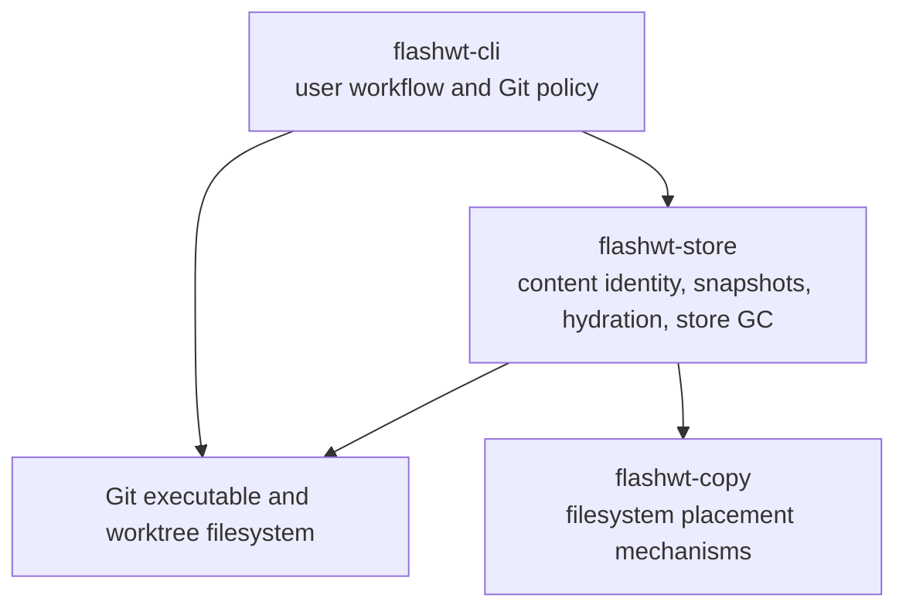

I’ll map the documented product thesis to the actual CLI and benchmark evidence, then evaluate it against the competitor capabilities you supplied. I’ll stay read-only and distinguish documented facts from product inferences.

The README already reveals a tension: it sells a narrowly useful hydration tool, while `CONTEXT.md` still describes a much broader store-first filesystem with watchers and direct agent access. I’m checking the ADR trail and spec sequence next to see which thesis the implementation actually follows.

The specs show the product repeatedly solving internal architecture after the core speed work landed. I’m now checking whether the benchmark suite proves the buyer-facing claim, and whether the shipped command set reduces adoption friction or mainly exposes more maintenance machinery.

One product risk stands out beyond positioning: the docs call the store the source of truth, but the shipped system behaves like a local cache populated from donor trees. I’m doing one last correctness pass on cache keying and first-run behavior because those directly affect whether teams will trust it on real native dependencies and toolchain upgrades.

# Verdict

**Do not launch this as a general-purpose worktree tool named `flashwt`.** The engineering is strong, but the current product framing walks directly into Worktrunk’s name, command, and category.

The segment `flashwt` can win is narrower:

> **Fast local environment hydration for macOS developers running several concurrent coding agents against large repositories.**

More concretely: APFS, 5,000-plus ignored files, repeated lockfile states, and several worktrees created per day. In that segment, a warm environment appearing in roughly 1.5 seconds is valuable. Outside it, the case weakens fast. The README admits the fixed overhead loses on small trees, and Linux lacks the whole-directory snapshot path that drives the best numbers (`README.md:41-50`, `docs/adr/0005-directory-snapshots.md:36-43`).

My score:

- Technical foundation: **8/10**
- Current differentiation: **5/10**
- Positioning: **3/10**
- Launch readiness: **4/10**
- Chance of winning the narrow segment after repositioning: **7/10**

## The segment to pursue

Target teams with all of these traits:

- macOS and APFS
- large Node, Rust, Python, or polyglot repositories
- three or more parallel worktrees or coding agents
- expensive ignored trees such as `node_modules`, `.venv`, or selected build artifacts
- dependency state that changes less often than worktrees are created

Do not target:

- general worktree management
- full development environments with ports, databases, Compose, or secrets
- ordinary developers creating one worktree every few days
- Linux-first teams
- small repositories
- reproducible or hermetic builds

Worktrunk already occupies general worktree workflow and uses the exact same `flashwt` command. Workz goes much further into environment orchestration. Trying to match either would bury the part of this product that is actually good.

The better relationship is compositional: Worktrunk or Workz creates and manages the workspace; this product hydrates its heavy local filesystem state.

## What is actually differentiated

CoW hydration alone is not enough. Mantle and Grove already establish that category. A lockfile-backed store is not enough either. Husk has a clearer compatibility model through lockfile plus OS and architecture keys.

The strongest combination here is:

1. **Whole-directory APFS snapshots**, rather than only per-file clones.
2. **Incremental snapshot rebuilding after small dependency changes.**
3. **Cross-ecosystem handling through filesystem trees rather than one package manager.**
4. **Agent-oriented automation**, including JSON output and leased scratch worktrees.

Of those, incremental rebuilds are the best technical story. The measured 17.8 to 5.3 second dependency-bump improvement is more interesting than generic “instant worktrees” (`README.md:34-40`). It tackles the steady-state failure mode where a cache is almost, but not quite, reusable.

That is still an engineering lead, not a durable moat. Another open-source tool can copy CAS, manifests, and clonefile calls. Defensibility would come from:

- a large compatibility corpus across package managers and native modules
- safe environment identity and invalidation
- reliable integrations with agent orchestrators and existing worktree tools
- trusted, reproducible benchmarks on real repositories
- years of filesystem edge-case handling

## Naming risk is severe

Using `flashwt` is a launch blocker, not a minor branding concern.

Worktrunk already uses the same command for an overlapping job. That causes:

- binary installation conflicts
- confused search results and documentation
- unclear bug reports
- package-manager naming conflicts
- inability to recommend both tools together
- immediate appearance of being a clone or fork, even if the implementation is unrelated

Rename the product and binary before `v0.1.0`. A short `flashwt` alias can be an optional install choice, but it should not be the canonical executable.

The final spec explicitly excludes public CLI changes (`.scratch/market-launch-readiness-and-deep-architecture/spec.md:113-120`). That is exactly the wrong constraint before the first public release.

## Product and trust problems to fix

### The store is a cache, not the source of truth

`CONTEXT.md` calls the store the source of truth and says a watcher keeps project trees coherent (`CONTEXT.md:8-19`). The shipped product scans donor directories, caches their contents, and has no watcher. ADR-0003 defers the watcher, while later specs keep it out of scope.

Call it an environment snapshot cache. “Source of truth” implies stronger mutation, recovery, and coherence guarantees than the current product provides.

### Cache identity is too weak

The fast path matches repository, hydration pattern, heavy directory, lockfile hash, and root mtime (`crates/flashwt-store/src/snapshot/projection.rs:189-227`). It does not visibly key on:

- OS and architecture
- package-manager version
- runtime or compiler version
- important environment variables
- ABI or native addon compatibility

This is where Husk’s OS and architecture keying is instructive. A local-only store reduces the risk, but it does not remove Rosetta, toolchain upgrade, Python interpreter, Node ABI, or native dependency problems.

Defaulting to broad entries such as `target/`, `.venv/`, `dist/`, and `build/` is aggressive (`crates/flashwt-cli/src/hydration_filter.rs:17-28`). A few hardcoded exclusions do not constitute a general validity model.

### The benchmark story is vulnerable

The benchmark suite is better than most early developer tools, but the marketing overstates what it proves.

- `benchmarks/run.sh` describes the install baseline as simulated file creation, not an actual package-manager install (`benchmarks/run.sh:4-10`).
- The README labels this “fresh install” and elsewhere says “Real Package Manager Install” (`README.md:34-49`).
- The headline numbers combine sessions and implementation stages. The handoff records 6.5 seconds in one session and about 1.6 seconds after later optimizations (`.scratch/fast-hydration/HANDOFF.md:139-157`).
- `flashwt demo` prints “100% CoW savings” and “0 B duplicated” rather than measuring physical allocation (`crates/flashwt-cli/src/commands/demo.rs:333-359`).
- `flashwt list` treats summed logical blob sizes as `bytes_saved`, despite the benchmark documentation correctly explaining that APFS sharing cannot be derived this way (`crates/flashwt-cli/src/commands/list.rs:113-178`, `benchmarks/run.sh:200-215`).

A skeptical developer-tools audience will find these discrepancies quickly. Tone the claims down before launch.

## Missing activation and adoption features

The product has a synthetic demo, completions, and nicer verbs. Those are useful, but they do not answer the first real adoption question: “Will this help my repository safely?”

The missing front door is something like:

```sh
product-name doctor
product-name init
product-name hydrate <existing-worktree>
```

It should report:

- filesystem and clone capability
- candidate directories and file counts
- estimated warm benefit
- compatibility risks
- why a directory is included or excluded
- relevant lockfile and environment identity
- whether the current repository is too small to benefit

Other important gaps:

1. **Hydrate existing worktrees.** Requiring this tool to own worktree creation forces a direct fight with Worktrunk and every agent orchestrator. Provide a standalone hydration command and documented hooks.
2. **Explicit initialization.** `flashwt new` currently writes `.flashwtinclude` automatically when absent (`crates/flashwt-cli/src/commands/create.rs:65-76`). Creating a branch should not unexpectedly dirty the main checkout.
3. **Create-and-enter shell integration.** Printing `Next: cd ...` is weaker than an optional shell function that creates and enters the worktree.
4. **Compatibility profiles.** Key or validate snapshots against runtime, toolchain, architecture, and package-manager identity.
5. **Real repository proof.** Publish results from representative open-source repositories using actual `pnpm`, `npm`, Cargo, and Python setup commands.
6. **Design-partner feedback.** There is extensive benchmark and architecture machinery, but no evidence in the repository of repeated external use, retention, or requested integrations.

## Does the final spec prioritize the right work?

**Mostly no.**

The release archive mismatch and installer failures are real blockers. Those should be fixed.

After that, the spec spends most of its effort on internal consolidation, test linking, formatting, dead wrappers, codecs, and shell completions. Much of it is good maintenance, but it will not answer whether anyone adopts the product.

Worse, the final spec is stale against the code:

- It asks to move ingestion into `flashwt-store`, but `crates/flashwt-store/src/ingest.rs` already exists.
- It asks for `output.rs`, which already exists and is used by command handlers.
- It asks for completions and README realignment, both already implemented.
- Every issue remains marked `ready-for-agent` with unchecked completion criteria.

That makes the final spec a poor operating document. It consolidates prior plans without reconciling current state. It also preserves backward compatibility before a public `v0.1.0`, when this is the cheapest and most important time to fix naming and command design.

## Ranked recommendations

1. **Rename the product and binary before release.** Treat the Worktrunk collision as P0.
2. **Reposition it as an environment hydration cache for agent worktrees on macOS/APFS.** Stop claiming the general worktree category.
3. **Add `hydrate <path>` and integrations for existing worktree managers.** Compete as the acceleration layer, not the workflow owner.
4. **Replace synthetic headline claims with real-project benchmarks.** Publish cold, warm, small-change, p50, and p95 results. Measure physical storage honestly or label it as estimated logical reuse.
5. **Build environment identity and invalidation before broad adoption.** Include OS, architecture, runtime, toolchain, and package-manager versions where relevant.
6. **Add `doctor` and explicit `init`.** Show expected value and risks before modifying a repository. Do not write `.flashwtinclude` during `new`.
7. **Recruit five design partners that run multiple coding agents daily.** Watch whether they keep using it after the first week. Their failures should decide the next spec.
8. **Reduce the public command set.** Lead with `hydrate`, `new`, `list`, and `clean`. Keep `scrub`, migrations, and store internals out of the normal help path.
9. **Fix release packaging after the rename.**
10. **Defer most internal consolidation until adoption evidence appears.** The code is already far more architected than the market thesis is validated.

No files were edited. I used read-only repository inspection and Git history/status commands only.


I’ll trace the create/hydrate/snapshot/GC/clean paths, then inspect release packaging and tests for safety claims. I’ll treat the preliminary verdict as a hypothesis and look for both disconfirming and aggravating evidence, without modifying the repo.

I’m mapping the command entry points to the storage code and looking for where invariants are enforced rather than assumed. In parallel, I’m checking packaging metadata and tests, since launch safety depends as much on what gets shipped as on the happy-path implementation.

The first pass already shows two areas where the preliminary verdict may be too mild: cleanup suppresses destructive-operation failures while reporting success, and release artifact naming appears inconsistent between CI and both installers. I’m now reading the lower-level transaction ordering to separate real data-loss risks from cache-only damage.

The cache trust boundary is weaker than the README claims. The lockfile fast path skips the tree walk based on a matching lockfile plus the heavy directory’s own mtime, which does not change when existing files are edited and does not cover nested directory changes. I’m checking whether any later validation closes that gap and whether the release workflow’s naming mismatch is caught by CI.


I’ll audit the product promise against the implementation and tests, then map the verified failures and competitor pressure into launch blockers, positioning changes, and post-launch work. I’ll keep the repository read-only and cite the exact paths supporting each conclusion.

The docs already expose a strategic split: `README.md` sells fast worktree hydration, while `CONTEXT.md` claims a broader file-store and watcher model that the launch spec does not deliver. I’m now checking whether the CLI’s safety model, demo path, package naming, and tests support the narrower product users can actually install today.

The first hard finding is worse than a packaging typo. The targeted cleanup path drops the parsed `force` flag before removal, so the modern command’s most obvious invocation has a different safety contract from batch cleanup. I’m reading the exact removal implementation and its tests next, along with the demo’s workload and the release pipeline.

The implementation confirms data loss by design, not an incidental Git behavior. `WorkspaceEngine::remove_worktree_lenient` tries `git worktree remove --force` first and swallows errors, and both targeted and selected batch cleanup call it. Existing cleanup tests only cover clean trees and committed divergence, so they never assert preservation of uncommitted files. I’m checking the hydration path now to separate the genuinely useful core from claims that outrun it.

The core is real: `flashwt new` creates a standard Git worktree, ingests matched untracked directories into `flashwt-store`, hydrates private writable copies, and records metadata used by `flashwt list`. Tests cover content identity, writable isolation, symlinks, modes, deduplication, and corrupt-store rejection. The remaining question is whether this removes setup work safely across branch changes, or merely copies the donor environment faster.

Lockfile handling improves cache selection, but it does not prove environment correctness for a different target branch. `create` always discovers heavy directories in the current checkout and hydrates those bytes into the new worktree, even when `--base` points elsewhere. The tests invalidate cache entries when the donor lockfile changes, but they do not test “donor lockfile A, target branch lockfile B” or run a package manager/build to verify the hydrated result.

One more issue changes the product verdict. `flashwt demo` uses the user’s normal store unless `FLASHWT_STORE` is set, writes 10,000 synthetic files into it, ignores teardown errors, and then sets `cleaned_up = true` unconditionally. It also prints “100% CoW savings” regardless of the actual fallback method. A demo that hangs, pollutes the real cache, and overstates its result cannot remain the launch-day proof point.


I’ll map the repository’s module seams and runtime flows first, then compare that evidence against the launch-readiness spec. I’ll keep this strictly read-only and cite the relevant project files.

The repository already contains several artifacts named in the proposal, including `workspace.rs`, `output.rs`, and `flashwt-store::ingest`, while old files still remain. I’m checking the actual call graph and invariants rather than treating the spec’s “current state” claims as authoritative.

The main seam is now clear: the CLI still owns workflow policy and Git, `flashwt-store` owns content identity plus most hydration and collection mechanics, and `flashwt-copy` owns filesystem placement strategies. Next I’m checking whether atomic writes, locks, and publication ordering actually uphold those claimed seams under concurrent processes and crashes.

Two safety distinctions matter here. Some metadata can safely lose concurrent updates because the cost is only a slower later run, but GC roots and snapshot validity cannot. I’m doing one final pass over published-snapshot validation and object publication to separate performance-cache races from data-liveness races.

## Overall assessment

The repository has a sensible top-level split:



The `flashwt-cli → flashwt-store → flashwt-copy` dependency direction is mostly right. Content identity and snapshot validity live in `flashwt-store`; platform copy behavior lives in `flashwt-copy`; command selection and Git-facing workflow live in `flashwt-cli`.

The problem is not crate placement so much as incomplete invariant ownership. Some important operations have two paths, one inside `flashwt-store` and one in `flashwt-cli`. Garbage collection also reaches upward into workspace lifecycle through an adapter. Those leaks matter more than most of the cleanup proposed by the spec.

The spec is also stale as a description of the current repository. `output.rs`, `workspace.rs`, `flashwt-store::ingest`, shell completions, and a store hydration engine already exist, although several old paths and wrappers remain. See `crates/flashwt-cli/src/output.rs:1-107`, `crates/flashwt-cli/src/workspace.rs:1-385`, `crates/flashwt-store/src/ingest.rs:1-188`, and `crates/flashwt-store/src/hydrate.rs:1-331`.

## Current module seams

### `flashwt-cli`

`flashwt-cli` owns:

- Clap command definitions and dispatch.
- Environment and command policy.
- Git repository and worktree operations.
- `.flashwtinclude` parsing and heavy-directory selection.
- Human and JSON presentation.
- Top-level orchestration of create, clean, scratch, and demo.

The normal create path is:

1. `WorkspaceEngine` discovers the repository and creates the Git worktree.
2. The CLI loads `.flashwtinclude`.
3. `HydrationEngine` discovers matching heavy directories.
4. Each directory is ingested through `DiskStore::ingest_tree`.
5. The resulting file map is passed back into `DiskStore::hydrate`.
6. The store materializes files or snapshots, writes the sidecar, claims legacy references, and publishes the GC mirror.

That flow is visible in `crates/flashwt-cli/src/commands/create.rs:34-91` and `crates/flashwt-cli/src/hydrate.rs:78-282`.

This is a partially deep module. The command handler gets a compact `HydrationEngine::hydrate` interface, but the CLI implementation still knows about lockfile classification, snapshot selection, store request construction, mirror publication, timing categories, and sidecar semantics. `HydrationEngine` hides code volume, but not enough knowledge.

### Workspace and Git operations

`WorkspaceEngine` is intended to be the single Git seam. It contains repository discovery, worktree enumeration, porcelain parsing, destination naming, merge checks, creation, and removal in `crates/flashwt-cli/src/workspace.rs:16-385`.

The module has not reached that goal:

- It exports both free functions and methods that do the same jobs.
- `demo`, `scratch`, and base tracking still call `workspace::run`, `repo_root`, `git_dir`, and `resolve_commit` directly. Examples appear in `crates/flashwt-cli/src/commands/scratch.rs:92-116` and `crates/flashwt-cli/src/commands/demo.rs:89-119`.
- `WorkspaceEngine::git` is a thin command runner rather than a domain-level interface.
- `clean` marks the first porcelain record as the main worktree instead of using `WorktreeMetadata::is_main`, leaking an ordering assumption into the caller at `crates/flashwt-cli/src/commands/clean.rs:101-116`.
- Removal policy is split among `WorkspaceEngine`, `flashwt-cli::gc`, `ScratchGuard`, and `StoreReclaimer`.

Consolidating Git lifecycle knowledge here is a good direction, but merely moving every raw Git invocation into one large file would not create depth. The useful interface is operation-shaped, such as enumerate cleanup candidates, create a linked worktree, or retire a workspace. A public generic `git(args)` method keeps Git argument and error semantics in every caller.

### `flashwt-store`

`flashwt-store` owns the important storage invariants:

- SHA-256 content identity and object layout.
- Durable blob publication.
- Verification and validation caches.
- Ingestion.
- Snapshot manifests, publication, and projection.
- Worktree mirrors and leases.
- Refcount and mirror-driven garbage collection.
- Most hydration bookkeeping.

Blob publication is strong. The store writes into the object shard, fsyncs the file, atomically renames it, and fsyncs the parent directory in `crates/flashwt-store/src/disk.rs:459-516`. GC mirrors use the same durable publication pattern in `crates/flashwt-store/src/mirror.rs:246-263`.

`DiskStore` is deep in the positive sense. Callers get hashing, deduplication, verification, atomic publication, filesystem capability probing, snapshots, and collection through one type. Its public interface is nevertheless becoming too broad. `crates/flashwt-store/src/lib.rs:25-56` re-exports low-level cache, journal, mirror, lease, snapshot, and migration operations. Many of these are implementation details that callers should not need.

The `Store` trait is shallow and has one implementation. Worse, its interface is dominated by the refcount model that the spec wants to remove, including `add_ref`, `release_ref`, and `ref_count` at `crates/flashwt-store/src/lib.rs:140-180`. Deleting the trait would not spread meaningful complexity across callers. Direct `DiskStore` methods would be simpler until a real second adapter exists.

### Ingestion

Moving ingestion into `flashwt-store` was correct. The store now owns the relation among source bytes, `ContentId`, the validation cache, symlink policy, mode capture, and bulk walking in `crates/flashwt-store/src/ingest.rs:1-23` and `crates/flashwt-store/src/ingest.rs:72-188`.

There are still two interface leaks:

1. `IngestOptions::snapshots` changes what the scanner records and whether unsupported filesystem objects fail. That ties ingestion semantics to a later projection strategy rather than defining one stable tree model.
2. The caller receives six parallel collections and must pass them back as six fields in `flashwt_store::HydrationRequest`. See `crates/flashwt-store/src/ingest.rs:38-60` and `crates/flashwt-store/src/hydrate.rs:18-59`.

An `IngestedTree` value is the natural invariant-bearing type. `DiskStore::hydrate` should accept it directly, or ingestion and hydration should be one store operation. The current 19-field hydration request is a shallow interface because callers must understand nearly the whole implementation.

### Hydration

Hydration is split across two modules named `hydrate`:

- `flashwt-cli::hydrate` owns discovery, lockfiles, presentation diagnostics, timing, toolchain relocation, and iteration over heavy directories.
- `flashwt-store::hydrate` owns snapshot projection, per-file placement, ref claims, the sidecar, and mirror publication.

That split is defensible if the CLI owns product policy and the store owns storage safety. The lockfile fast path breaks it.

`flashwt-cli::HydrationEngine` calls `SnapshotProjectionEngine::try_lockfile_hit` directly and then writes `flashwt-hydrated.tsv` and publishes the mirror itself in `crates/flashwt-cli/src/hydrate.rs:156-203`. The normal snapshot path performs those steps inside `DiskStore::hydrate`, including legacy ref claims, at `crates/flashwt-store/src/hydrate.rs:115-157`.

This creates two invariant owners. It also appears unsafe in legacy GC mode: the CLI fast path publishes a snapshot mirror but does not add legacy references for the snapshot’s blobs. Legacy sweep ignores mirrors and derives liveness from `refs/`, as documented in `crates/flashwt-store/src/gc.rs:5-16`. The fast path therefore bypasses the mechanism that legacy collection trusts.

The lockfile shortcut belongs inside `DiskStore::hydrate`, behind the same finalization protocol as every other hydration path.

### `flashwt-copy`

`flashwt-copy` has two genuine kinds of operation:

- Whole-directory copying through `CopyBackend`.
- Per-file store materialization through `FileMaterialize` and `Materializer`.

Those are real seams, not needless abstractions. Whole-tree clonefile, reflink, hardlink, and deep-copy adapters vary by platform and mechanism. The hardlink source policy also protects an important invariant: a mutable checkout must never be used as a hardlink source. See `crates/flashwt-copy/src/lib.rs:8-21` and `crates/flashwt-copy/src/lib.rs:144-185`.

Some abstractions around them are shallow:

- `CopyEngine::materialize_file` constructs a `Materializer` and forwards one call.
- `CopyEngine::materialize_files` chooses capabilities from the first item and loops.
- `DiskStore::hydrate` does not use that batch interface despite its module documentation claiming delegation through `CopyEngine`; it constructs `Materializer` directly at `crates/flashwt-store/src/hydrate.rs:170-233`.
- `Materializer::for_directories` is a pure alias in `crates/flashwt-copy/src/materialize.rs:248-251`.
- `Safety::UnsafePending` describes no current adapter and adds an error mode every caller must understand at `crates/flashwt-copy/src/lib.rs:95-117`.

Removing the forwarders and dead safety state is reasonable. Removing `CopyBackend`, `FileMaterialize`, `SourcePolicy`, or centralized fallback classification would be a mistake. Those interfaces hide real platform variance and safety policy.

### Snapshots

Snapshots correctly belong in `flashwt-store`. The module owns canonical manifests, content-derived identity, winner validation, staging, projection, and GC reachability. The internal split among manifest, publish, projection, and tree code is coherent in `crates/flashwt-store/src/snapshot/mod.rs:33-54`.

Concurrent publication uses a good winner protocol. Each builder stages privately, atomically renames, validates an existing winner, and refuses to overwrite invalid debris in `crates/flashwt-store/src/snapshot/publish.rs:146-160` and `crates/flashwt-store/src/snapshot/publish.rs:487-579`.

There is a crash-safety hole in the validity claim. Publication fsyncs `manifest.tsv` and `.complete`, but I found no fsync of the staged `tree/` directory entries before the final rename. `read_published` validates only the manifest and `.complete`; it does not prove that every tree entry exists or matches the manifest. See `crates/flashwt-store/src/snapshot/mod.rs:76-97` and `crates/flashwt-store/src/snapshot/mod.rs:117-146`.

After power loss, metadata could survive while some hardlink or directory entries in `tree/` do not. The next run could accept and clone an incomplete snapshot. Since snapshots are enabled by default on APFS, this is worth fixing before release.

### Garbage collection

The store-local mirror design is good. It avoids scanning every Git repository and makes roots explicit. Malformed young mirrors stop deletion, dead roots receive a grace period, and snapshots are treated as caches rather than truth. These decisions are well reasoned in `docs/adr/0004-mark-and-sweep-gc.md:12-35` and implemented in `crates/flashwt-store/src/gc.rs:202-335`.

The larger issue is coordination between hydration and sweep. Neither mirror-driven sweep nor legacy sweep takes a store-wide exclusion lock. The grace period protects newly written objects by mtime, but it does not protect an old object reused by a new hydration before that hydration publishes its mirror or increments its refcount.

A possible race is:

1. Hydration finds an old existing blob.
2. Sweep observes no current root or ref for that blob.
3. Sweep deletes it.
4. Hydration verifies, materializes, claims a reference, or publishes a mirror.

Depending on timing, the create fails, leaves a partial worktree, or publishes metadata naming an absent store object. Legacy sweep also reads and deletes ref files without holding the `refs/` lock used by `add_ref` and `release_ref`; compare `crates/flashwt-store/src/disk.rs:399-430` with `crates/flashwt-store/src/disk.rs:535-576`.

The grace-period assertion in `CONTEXT.md:49-54` is therefore stronger than the implementation. Hydration needs an intent root, a shared store-operation lock with sweep taking exclusive access, or an equivalent per-object protocol.

`StoreReclaimer` also owns too much workspace policy. It reads Git administrative files, derives scratch branch names, calls a `WorkspaceCleaner`, and removes directories in `crates/flashwt-store/src/gc.rs:724-847`. The single production adapter lives back in the CLI at `crates/flashwt-cli/src/gc.rs:202-267`.

Store GC should own store roots, objects, snapshots, and leases. Git branch and worktree removal should remain in the workspace module. The current callback makes `flashwt-store` depend conceptually on CLI workflow even though Cargo dependencies point the other way.

## Judgment on the spec

### Act on before v0.1.0

1. **Unify hydration finalization.** Move the lockfile fast path behind the store hydration interface. Sidecar, ref, and mirror publication must have one owner.

2. **Define hydration versus sweep coordination.** The code needs a concrete invariant for in-flight reuse of old blobs. The current grace period is not sufficient.

3. **Make snapshot validity match crash claims.** Either make the entire staged tree durable before `.complete` becomes authoritative, or validate the tree against the manifest before accepting a hit.

4. **Choose the v0.1 GC model deliberately.** The current default remains legacy refcount collection, which incurs a durable ref write per distinct blob. That conflicts with the product’s speed goal. Making mark-and-sweep the sole v0.1 model is reasonable, but it requires an explicit compatibility decision and an ADR update.

These are bounded safety and product-contract changes. They should block release.

### Good consolidation, but not release blockers

- Deepening workspace operations and eliminating free-function bypasses.
- Passing `Ingested` directly into hydration.
- Removing `CopyEngine` forwarders and `Materializer::for_directories`.
- Removing the unused `Safety::UnsafePending` state.
- Removing dead `HydrationFilter` and `manifest.rs` compatibility wrappers if nothing external can import this binary crate.
- Centralizing JSON emission.
- Converting duplicate Clap variants to aliases.
- Removing direct CLI hashing dependencies.
- Consolidating integration test binaries and fixtures.
- Formatting and presentation cleanup.

These improve locality and navigation, but none should delay v0.1 once correctness, packaging, and core performance are proven.

### Decisions that need revision

**Replacing the snapshot journal with one atomic TSV file.** Atomic rename prevents torn files, but it does not prevent lost updates when two processes load, modify, and replace the same file. The existing journal exists for concurrent appends. It is complicated, but the proposed replacement needs either:

- an exclusive metadata lock around load, modify, and save, or
- an explicit decision that lost selection and LRU updates are acceptable because they only affect cache performance.

The current journal is not perfect either. Appenders do not take `MetadataLock`, while compaction reads and rewrites the journal under that lock. An append racing the final read/truncate sequence can be lost. See `crates/flashwt-store/src/snapindex.rs:511-520` and `crates/flashwt-store/src/snapindex.rs:561-645`.

A locked single-file implementation would be simpler and adequate. An unlocked one should not be described as concurrency-safe.

**Purging GC migration machinery while claiming zero breakage and ADR compliance.** The proposal conflicts with ADR-0004, which explicitly requires dual-write and operator-controlled cutover for downgrade safety in `docs/adr/0004-mark-and-sweep-gc.md:37-52`. For a first public release, dropping pre-release compatibility may be the right tradeoff. It is not a zero-breaking-change cleanup, though. Amend the ADR and state which pre-v0.1 stores are unsupported or automatically migrated.

**Putting all lifecycle behavior in `WorkspaceEngine`.** The direction is right, but avoid turning it into a bag of raw Git wrappers. It should own domain operations and their ordering. `git(args)` should be internal wherever possible.

## Release verdict

The full consolidation program should **not** block v0.1.0. It mixes release packaging, correctness work, performance work, module cleanup, naming changes, documentation, and test organization into one oversized gate.

I would block v0.1.0 only on:

- release artifact and installer correctness,
- one safe and performant GC mode,
- hydration versus sweep coordination,
- removal of the lockfile fast-path invariant bypass,
- snapshot crash validity on the default APFS path,
- focused end-to-end tests for those cases.

Ship the remaining architectural cleanup after v0.1 in smaller changes. The current crate split is sound enough to release. The urgent work is making each critical invariant have exactly one owner, not deleting every historical abstraction before the tag.

No files were edited and no tests were run; this was a read-only source and architecture review.

I’ll first map the repository and read the launch-readiness spec, then trace release/install paths, platform claims, error handling, tests, and safety controls. I’ll keep the audit read-only and separate true launch blockers from architectural cleanup.

The spec bundles launch mechanics with a large internal consolidation program, so I’ll verify each market-facing claim against the current tree rather than assume the problem statement is current. Next I’m reading the actual release contract, installer/formula, CLI entry points, and CI gates.

A concrete packaging failure is already visible: `release.yml` emits `flashwt-0.1.0-*`, while both installers consume `flashwt-v0.1.0-*`. The smoke test hides this by constructing its own `v`-prefixed fixtures instead of testing artifacts produced by the workflow. I’m now tracing destructive commands, exit/error contracts, and test coverage for release-sensitive behavior.

The destructive path is more serious than the spec suggests. `flashwt clean --all` selects every linked worktree, including unmerged ones, and the lower layer uses forced Git removal plus `branch -D`; several failures are swallowed while receipts still report success. I’m checking the store retirement order and create rollback path now, because those determine whether failures can lose user work or corrupt GC roots.

I’ve confirmed the GC root is retired before worktree deletion, and deletion errors are discarded. That means a failed removal can leave a live worktree unprotected from a later sweep while the command returns success. I’ll finish with read-only executable and syntax checks, plus a focused inventory of release and safety test gaps.

The remaining distinction is between actual release blockers and cleanup that can wait. I’m doing one final pass over repository state, manifest/path boundaries, publish metadata, and spec issue status so the final ranking does not inflate refactors into launch requirements.

# Launch audit verdict

**Not ready for a public v0.1.0 tag.**

The release pipeline cannot currently produce assets that the installer and Homebrew formula expect. More seriously, `flashwt clean` can force-delete unmerged worktrees and branches while suppressing removal failures. The spec catches some packaging problems, but misses the destructive cleanup behavior.

## Launch blockers

### 1. Release asset names are incompatible

`.github/workflows/release.yml:72-85` creates:

```text
flashwt-0.1.0-<target>.tar.gz
```

The consumers require:

```text
flashwt-v0.1.0-<target>.tar.gz
```

See:

- `install.sh:55-76`
- `Formula/flashwt.rb:13-25`
- `scripts/gen-formula.sh:19-33`

The release job then calls `scripts/gen-formula.sh` against the incompatible artifacts at `.github/workflows/release.yml:99-103`, so formula generation fails before publishing.

`scripts/smoke-install.sh:37-68` does not catch this. It creates its own correctly named `flashwt-v...` archives instead of packaging artifacts through the same logic as `release.yml`.

**Classification:** unconditional launch blocker.

### 2. `flashwt clean` can destroy unmerged work

The command documentation says `--all` removes "stale/merged worktrees" at `crates/flashwt-cli/src/cli.rs:50-65`. The implementation instead selects every linked worktree when `all` is true at `crates/flashwt-cli/src/commands/clean.rs:151-152`, including unmerged and dirty worktrees.

Removal then:

- Runs `git worktree remove --force` in `crates/flashwt-cli/src/workspace.rs:365-373`.
- Deletes the branch with `git branch -D` in `crates/flashwt-cli/src/workspace.rs:381-384`.
- Falls back to `remove_dir_all` in `crates/flashwt-cli/src/gc.rs:217-233`.
- Ignores Git and filesystem errors throughout that path.

The batch loop also ignores errors from `gc::remove` and still appends the worktree and branch to the success receipt at `crates/flashwt-cli/src/commands/clean.rs:276-298`.

The lower-level retirement order compounds this. It releases references, deletes the ledger, and removes the GC mirror before attempting worktree removal at `crates/flashwt-store/src/gc.rs:955-985`. If deletion fails, the live worktree may remain without a GC root, and the command still returns success.

The tests do not cover dirty worktrees or failed deletion. `crates/flashwt-cli/tests/clean.rs:214-217` explicitly treats `--all` as permission to delete unmerged work, without requiring `--force`.

**Classification:** unconditional launch blocker because it risks unrecoverable user data loss.

### 3. The advertised Homebrew command is not the tested installation path

`README.md:64-74` recommends installing a formula directly from a release URL and claims `brew upgrade flashwt` will work normally.

The smoke test says recent Homebrew versions refuse bare formula files and therefore creates a temporary tap instead at `scripts/smoke-install.sh:102-121`. That is materially different from the README path. The workflow never tests:

```sh
brew install https://github.com/.../releases/latest/download/flashwt.rb
```

Even if direct URL installation works on a particular Homebrew version, it does not establish a persistent tap-based update source for the documented upgrade flow.

**Classification:** launch blocker for the advertised Homebrew installation channel. Either publish a real tap or change and test the documented installation contract.

### 4. Linux ARM64 is promised by the launch spec but unavailable

Only these targets ship:

- Apple ARM64
- Apple x86-64
- Linux x86-64

See `.github/workflows/release.yml:24-36`.

`install.sh:20-28` rejects `Linux/aarch64`, and `Formula/flashwt.rb:23-25` has only an x86-64 Linux artifact. Meanwhile, the README describes the installer as supporting "macOS and Linux" without an architecture qualification at `README.md:76-82`.

**Classification:** blocker if Linux ARM64 is part of the declared v0.1.0 market, as required by `.scratch/market-launch-readiness-and-deep-architecture/spec.md:9,23,33,51-55`. Otherwise, narrow the platform claim before launch.

## High-priority risks

### Release and installation

- **Bare `FLASHWT_VERSION` remains broken.** `install.sh:35-36` uses the caller-provided value as the GitHub tag. `FLASHWT_VERSION=0.1.0` therefore requests the nonexistent `download/0.1.0/` path, although the archive name is normalized later at `install.sh:55-58`. The smoke test only covers the already-prefixed form at `scripts/smoke-install.sh:71-76`.

- **Cross-target binaries are executed during packaging.** `.github/workflows/release.yml:76-78` runs each target binary to generate completions. One macOS runner label builds both Apple architectures, so this depends on cross-architecture execution or Rosetta availability. Completion generation should not require executing the release target binary.

- **Installer replacement is not atomic.** `install.sh:74-80` moves the new binary over the destination before proving it runs. A bad or incompatible binary can destroy an existing working installation. Its validation only checks that output starts with `flashwt ` at `install.sh:82-88`, not that the installed version equals the requested release.

- **The "static binary" claim is inaccurate.** Releases use `x86_64-unknown-linux-gnu` at `.github/workflows/release.yml:34-35`, which normally depends on glibc. The inspected macOS release binary also links system libraries. `README.md:100` should say "single binary" unless musl or another genuinely static Linux target is shipped.

- **No release dry run exists.** CI tests hand-built installer fixtures but never validates the release workflow's package names, generated checksums, formula generation, or final asset set as one contract. There are no repository tags yet, so the tag workflow has no demonstrated run in this checkout.

### CLI safety and error handling

- **Explicit single cleanup is always forceful.** `clean_single_worktree` does not receive or check the `force` argument at `crates/flashwt-cli/src/commands/clean.rs:44-60`. The actual removal path force-removes the worktree and force-deletes its branch.

- **Interactive `all` has no destructive confirmation.** Typing `all` selects unmerged worktrees at `crates/flashwt-cli/src/commands/clean.rs:203-223`, with no second confirmation and no requirement for `--force`.

- **Creation has no rollback.** Git creates the branch and worktree at `crates/flashwt-cli/src/commands/create.rs:54`; manifest loading, store opening, ingestion, hydration, and toolchain relocation all happen afterward. Any later failure returns an error but leaves a partial worktree and branch behind.

- **Lease expiry can delete a running sandbox.** A lease is reclaimed when it is dead, expired, or orphaned at `crates/flashwt-store/src/gc.rs:753-760`. Expiry wins even when the owning process is alive. With the one-hour default in `crates/flashwt-store/src/lease.rs:22-23`, a long-running `scratch --run` job can be deleted by a concurrent sweep. `crates/flashwt-cli/tests/lease_sweep.rs:121-159` confirms that this is current behavior.

- **Machine-readable errors lose type information.** Typed Rust errors and exit codes are sensible at `crates/flashwt-cli/src/main.rs:33-55`, but every JSON failure becomes diagnostic code `"ERROR"` at `crates/flashwt-cli/src/main.rs:39-43`. Automation cannot reliably distinguish usage, Git, store, integrity, and I/O failures without parsing prose.

### Documentation and platform claims

- **Linux behavior is misstated.** `README.md:26` says Linux uses hardlinks. Default hydration actually selects reflink, `copy_file_range`, or byte copy; hardlinks require `FLASHWT_HARDLINK` at `crates/flashwt-cli/src/config.rs:90-98` and `crates/flashwt-copy/src/materialize.rs:260-304`.

- **Completion claims exceed implementation.** Static completion generation exists for five shells, but no dynamic branch-name completer is present. Tests in `crates/flashwt-cli/tests/completions.rs` check command and flag output, not branch names. The standalone installer only installs Bash, Zsh, and Fish completions at `install.sh:138-149`, despite the README's broader shell list at `README.md:84-92`.

- **Performance claims need reproducible context.** `README.md:30-49` gives precise benchmark figures without hardware, OS version, filesystem, commit, or a checked-in result artifact. That is a launch credibility risk, not a code blocker.

## Test and CI assessment

### Good coverage

The repository has useful end-to-end coverage for:

- JSON envelopes and failure output in `crates/flashwt-cli/tests/json_output.rs`.
- Copy-on-write isolation in `crates/flashwt-cli/tests/cow_materialization.rs`.
- GC and interrupted state in `crates/flashwt-cli/tests/gc.rs`.
- Mirror-based collection in `crates/flashwt-cli/tests/gc_mirror.rs`.
- Lease cleanup in `crates/flashwt-cli/tests/lease_sweep.rs`.
- Shell completion generation in `crates/flashwt-cli/tests/completions.rs`.
- macOS-specific APFS behavior, with macOS lint and test jobs in `.github/workflows/ci.yml:9-44`.
- Weekly RustSec checking in `.github/workflows/security-audit.yml`.

Atomic mirror and lease publication is carefully implemented in:

- `crates/flashwt-store/src/mirror.rs:246-262`
- `crates/flashwt-store/src/lease.rs:125-133`
- `crates/flashwt-store/src/fsutil.rs`

### Missing launch gates

- No test derives installer fixtures from the release workflow.
- No test covers bare and prefixed `FLASHWT_VERSION`.
- No ARM Linux build or installer job.
- No dirty-worktree refusal test.
- No failed-removal or permission-denied test.
- No assertion that reported cleanup success matches actual Git and filesystem state.
- No create-failure rollback test.
- `bench.yml` triggers pushes to `master` at `.github/workflows/bench.yml:7-12`, while the inspected repository is on `main`, so normal pushes do not run it.
- The benchmark chaos test kills a PID without first proving it is still running at `benchmarks/chaos.sh:47-64`; a fast create can finish before the signal, producing false crash-resilience coverage.
- CI uses `stable`, but does not test the declared MSRV of Rust 1.85 from `Cargo.toml:14-21`.
- Actions are version-tag pinned rather than commit-SHA pinned, which weakens CI supply-chain controls.

There are 26 `flashwt-cli` integration-test binaries, five `flashwt-store` binaries, and two `flashwt-copy` binaries. Consolidating them may improve link time, but it is maintainability work unless CI is currently missing required checks because of runtime.

## Post-launch maintainability work

These should not hold the release once packaging and data safety are fixed:

- Consolidate the 26 CLI test binaries and shared fixtures.
- Remove dead `HydrationFilter` wrappers and `manifest.rs` forwarding.
- Convert duplicate Clap variants into aliases, while preserving JSON command-name behavior.
- Centralize repeated JSON emission.
- Remove `flashwt-cli`'s direct `sha2` dependency.
- Simplify presentation helpers and workspace wrappers that remain duplicated.
- Simplify snapshot-index internals after crash and concurrency invariants have dedicated tests.
- Remove legacy refcount migration code only after defining downgrade compatibility and store migration policy.
- Unify benchmark parsing and add reliable process-liveness checks.

## Spec assessment

Yes, the spec mixes market readiness with refactoring, and the mixture obscures the release-critical work.

The actual market-readiness scope is mostly:

- Release assets and platform matrix.
- Installer and Homebrew behavior.
- Documentation accuracy.
- Completion packaging.
- Destructive-command safety.
- Release-contract tests.

That corresponds mainly to decisions 1 and 7 in `.scratch/market-launch-readiness-and-deep-architecture/spec.md:51-55,93-104`, plus the missing cleanup-safety work.

The remaining decisions are internal consolidation:

- GC migration deletion.
- Snapshot-index redesign.
- Store ingestion ownership.
- Copy-engine cleanup.
- Presentation and workspace restructuring.
- Test binary consolidation.

Those occupy most of `.scratch/market-launch-readiness-and-deep-architecture/spec.md:57-92,99-104` but do not determine whether users can safely install and run v0.1.0.

The spec also has consistency problems:

1. It promises "zero-breaking-change" at `spec.md:21` and full backward compatibility at `spec.md:121-124`, while deleting refcount migration machinery that ADR-0004 explicitly retains for downgrade safety in `docs/adr/0004-mark-and-sweep-gc.md:37-52`.

2. Converting `New`, `Isolate`, and `TestDrive` into Clap aliases may change JSON envelope command names. Current names are alias-specific at `crates/flashwt-cli/src/cli.rs:204-220`. That conflicts with the promise not to change version 1 JSON behavior.

3. Several stated gaps are already implemented:
   - Completions exist in `crates/flashwt-cli/src/commands/completions.rs`.
   - Completion integration tests exist in `crates/flashwt-cli/tests/completions.rs`.
   - README workflow and APFS defaults are updated at `README.md:102-155`.
   - Presentation code exists in `crates/flashwt-cli/src/output.rs`.
   - Workspace consolidation exists in `crates/flashwt-cli/src/workspace.rs`.
   - Tree ingestion already lives in `crates/flashwt-store/src/ingest.rs`.

   Yet the spec and every associated issue remain `Status: ready-for-agent`, including the stale completion issue at `.scratch/market-launch-readiness-and-deep-architecture/issues/09-shell-completions-and-documentation-realignment.md`.

I would split the work into a short **v0.1 launch gate** and a separate **post-v0.1 architecture cleanup** track. The safety defect in `flashwt clean` belongs in the launch gate and currently is not represented.

## Read-only validation performed

- Confirmed the working tree is clean at commit `3ad1379`.
- Ran shell syntax checks for `install.sh`, `scripts/gen-formula.sh`, and `scripts/smoke-install.sh`.
- Ran `ruby -c Formula/flashwt.rb`.
- Inspected the existing `target/debug/flashwt` help and version output.
- Inspected the existing release binary format and linked libraries.
- Did not run `cargo build`, `cargo test`, installer smoke tests, or benchmarks because they write build artifacts, temporary repositories, installations, or Homebrew state, which would violate the requested read-only audit.

I’ll trace the problem statement through the architecture, ADRs, implementation, benchmarks, and end-to-end tests, then separate eliminated setup work from setup work that is merely shifted or accelerated. I’ll keep the repository unchanged.

I’m starting with the repository map and the documents that make the claim. After that I’ll follow the actual command paths and compare the benchmark fixtures with the test coverage.

The docs already expose one important tension: `README.md` promises hydrated worktrees, while `CONTEXT.md` describes a broader store-backed filesystem model with a watcher and direct agent access. I’m checking which of those two systems the code actually implements.

The implementation is one-shot source-tree capture plus destination hydration. It does not install dependencies, invoke a build, or keep later mutations synchronized. Next I’m testing the strength of the evidence: what the benchmark baseline really measures, whether it includes cold-store cost, and which safety properties the tests prove.

The test suite is strong on filesystem fidelity and failure recovery, but the product claim is broader than those properties. I’m doing one final pass for real package-manager/build workloads, cross-platform defaults, source selection, and any evidence that benchmark numbers were checked into the repository rather than only quoted in the README.

One correctness risk needs closer inspection before I give a verdict. The APFS O(1) fast path appears to trust a pinned lockfile plus the top-level heavy-directory mtime. A nested file can change without changing that directory mtime, so I’m checking whether another guard closes that hole.

I’ve got enough evidence for the main verdict. I’m checking two operational details that affect risk: the default GC mode and whether concurrent creates or source mutation are covered, since parallel-agent use is the central claim.

# Verdict

`flashwt` solves a real, narrower problem than `README.md` and `CONTEXT.md` sometimes claim.

It genuinely removes repeated filesystem materialization when several worktrees need the same large, already-built directory. On macOS/APFS, the snapshot design attacks that cost at its source by cloning a whole directory tree rather than recreating thousands of files. For parallel agents starting from the same revision and dependency state, this can turn one install or build plus several cheap clones into several ready worktrees.

It does **not** end dependency installation or build-cache setup in general. It moves an existing environment from a donor checkout into new worktrees. The first valid environment must still be installed or built, later validity is mostly delegated to external tools, and divergent branches eventually pay their normal setup costs. Build outputs are especially questionable because `flashwt` copies them without an input-keyed validity model.

My assessment:

- The narrow README claim, "hydrate heavy untracked directories into new worktrees," is substantially implemented.
- The stronger claim, "No reinstalling. No rebuilding," is conditional and overstated.
- The `CONTEXT.md` architecture, where the store is authoritative, trees stay synchronized, and agents work directly through the store, is not implemented.
- The best-supported use case is large, immutable or self-validating environments on APFS.
- The weakest-supported use case is arbitrary build caches across diverging branches, operating systems, toolchains, and concurrent agent mutations.

## What the code actually does

`flashwt create` performs this sequence:

1. It runs `git worktree add`.
2. It scans the current checkout for directories selected by `.flashwtinclude`.
3. It ingests their files into a machine-local SHA-256 store.
4. It recreates those directories in the new worktree using:
   - Whole-directory APFS snapshots on the fast path.
   - Per-file APFS clones or Linux reflinks.
   - `copy_file_range` or byte copies where sharing is unavailable.
   - Experimental read-only hardlinks only when explicitly requested.
5. It writes hydration and GC metadata.
6. It rewrites some absolute paths inside Python virtual environments.

The orchestration is clear in `crates/flashwt-cli/src/commands/create.rs:34-92`. Discovery and ingestion always use the current checkout as `root`; the destination worktree is only the hydration target. `crates/flashwt-cli/src/hydrate.rs:132-282` shows the donor-directory scan, lockfile optimization, ingest, and materialization.

This is a snapshot copier with a content-addressed backing store. It is not a package manager or build cache:

- It never runs `npm install`, `pnpm install`, `pip`, `uv`, or an initial build.
- It does not derive dependencies from a lockfile and construct an environment.
- It does not key build artifacts by compiler version, flags, source revision, environment, target triple, or other build inputs.
- It does not synchronize a worktree after creation.
- It does not make changes from one hydrated worktree available to later worktrees unless those changes also reach the donor checkout.

## Root-cause solving versus symptom optimization

### It addresses the root cause of repeated file creation

For a stable heavy directory, the immediate problem is that Git worktrees share Git objects but not ignored files. Recreating 40,000 files for each agent is needless if the exact tree already exists locally.

The APFS snapshot path removes that repeated operation:

- Snapshots are addressed by a canonical manifest and stored as complete directory trees.
- A hit uses one recursive `clonefile(2)` operation instead of one placement per file.
- The destination files have private inodes and share storage blocks until modified.

That architecture is documented in `docs/adr/0005-directory-snapshots.md:3-39` and implemented in `crates/flashwt-store/src/snapshot/projection.rs`. The private-write behavior and block sharing receive direct macOS coverage in `crates/flashwt-cli/tests/cow_materialization.rs:64-239`.

For the workload "create ten identical worktrees from the same prepared checkout," this is more than a faster install script. It removes nine repeated materializations.

### It amortizes dependency setup rather than eliminating it

`flashwt` needs an existing donor directory. The store is populated by scanning that directory, as stated explicitly in `.scratch/instant-worktrees/spec.md:78-80`.

The true lifecycle is:

```text
install or build once in donor
        ↓
scan and ingest donor
        ↓
clone it into N worktrees
        ↓
package manager or build tool validates and repairs each divergent tree
```

This is a good amortization strategy. It is not an independent solution to dependency installation. A clean machine, missing donor environment, or new dependency graph still needs the normal toolchain.

This distinction matters because package managers already attack part of the same problem. ADR-0002 recognizes that pnpm has a global content store and explicitly rejects competing as a package manager in `docs/adr/0002-tool-agnostic-worktree-hydration-first.md:3-16`. But the committed benchmark does not compare `flashwt` with pnpm, uv, or another modern warm package-manager cache.

### Build caches are copied without knowing whether they are valid

For dependency directories, a lockfile often gives a reasonable identity for the desired environment. Build outputs are different. Their validity can depend on:

- Source files and generated inputs.
- Compiler and linker versions.
- Features, flags, and environment variables.
- Absolute paths.
- Native architecture and SDK versions.
- Concurrent writes and partially completed builds.

`flashwt` has no general validity policy for these inputs. The fast-hydration specification explicitly lists "artifact validity policy" as out of scope in `.scratch/fast-hydration/spec.md:158-162`.

Instead, it excludes a short list of known volatile directories:

- Rust incremental state.
- Next.js cache.
- Vite cache.

See `crates/flashwt-cli/src/hydration_filter.rs:17-28` and `crates/flashwt-cli/src/toolchain.rs:11-19`. This reduces known corruption risks, but it is a blacklist. The defaults still include broad directories such as `target/`, `dist/`, `build/`, and `.cache/`. Other path-dependent or non-portable caches can be copied without validation.

For build outputs, `flashwt` mostly optimizes the symptom, "my fresh worktree starts empty." It relies on Cargo or another build system to recognize and repair stale artifacts afterward.

## The gap between `CONTEXT.md` and the implementation

`CONTEXT.md` describes a broader architecture:

- The store is the source of truth for code.
- Trees are projections kept coherent by a watcher or synchronization layer.
- Agents may work directly through the store.

See `CONTEXT.md:8-19` and `CONTEXT.md:32-34`. ADR-0001 repeats that model and says a watcher must maintain coherence in `docs/adr/0001-store-is-truth-tree-is-a-projection.md:18-22`.

None of that exists in the current runtime:

- The current checkout is the effective source of truth during ingestion.
- Existing worktrees are deliberately not updated when the donor changes, as tested in `crates/flashwt-cli/tests/cache_flow.rs:80-115`.
- There is no watcher or daemon.
- There is no agent-facing store protocol.
- The store does not accept agent edits and project them back into trees.

The project specs acknowledge this. Watchers, direct agent access, and mutation semantics beyond one-shot hydration are out of scope in `.scratch/fast-hydration/spec.md:168-169` and `.scratch/instant-worktrees/spec.md:106-113`.

Therefore, `CONTEXT.md` is partly an aspirational domain model, not a description of the shipped system. Calling stored blobs "the source of truth for code" is inaccurate for the current implementation. They are a cache of selected ignored files.

## Correctness and staleness risks

### The APFS lockfile fast path can return stale nested content

This is the most serious issue I found.

On macOS, `SnapshotProjectionEngine::try_lockfile_hit` skips the tree walk when:

- A recognized lockfile is classified as pinned.
- Its hash matches a stored snapshot.
- The top-level heavy-directory mtime does not appear newer.

See `crates/flashwt-store/src/snapshot/projection.rs:106-120` and `crates/flashwt-store/src/snapshot/projection.rs:189-230`.

Changing the contents of a nested file does not normally update the top-level `node_modules` directory mtime. Therefore this sequence can serve an old snapshot:

1. Create a snapshot for `node_modules`.
2. Modify `node_modules/pkg/lib/file.js` without changing the lockfile.
3. Create another worktree.
4. The lockfile and top-level directory mtime still match.
5. `flashwt` clones the old snapshot without walking or hashing the changed file.

This can happen with patched dependencies, lifecycle scripts, manual edits, local tool-generated files, corruption, or caches stored inside the selected tree.

The relevant lockfile test does not close the hole. `directory_timestamp_change_triggers_revalidation` changes a nested file's timestamp, then only checks that the destination file exists. It does not assert that the modified timestamp or content reached the destination, in `crates/flashwt-cli/tests/lockfile_fastpath.rs:243-271`.

By contrast, `cache_flow.rs` has good nested-edit tests, but those fixtures lack a recognized lockfile and therefore do not exercise the O(1) fast path. See `crates/flashwt-cli/tests/cache_flow.rs:80-115`.

`FLASHWT_VERIFY=1` bypasses snapshot hits, but the README presents that as a paranoid opt-in rather than necessary protection.

### The donor may not match the destination branch

`flashwt create --base other-branch` creates the Git worktree from the requested base, but it still hydrates from the current checkout:

- Worktree base selection happens in `crates/flashwt-cli/src/commands/create.rs:47-55`.
- Hydration receives `root` as the source and `dest` as the target at `crates/flashwt-cli/src/commands/create.rs:82-89`.
- The source path is always `req.root.join(rel)` in `crates/flashwt-cli/src/hydrate.rs:132-145`.

If the current checkout and `--base` have different lockfiles, generated code, or compiler settings, the new worktree receives the current checkout's environment. External tools may repair it, but the "already ready" promise does not hold.

The same concern applies when `create_worktree` falls back to checking out an existing branch in `crates/flashwt-cli/src/workspace.rs:355-362`.

### Integrity checks prove bytes, not semantic validity

The content-addressed store can detect corruption of stored blobs. It cannot determine whether the donor tree was correct in the first place.

A partially completed install, poisoned generated output, or stale build directory gets hashed and preserved faithfully. The benchmark's ".DS_Store poisoning" scenario measures incremental manifest rebuild performance. It does not demonstrate semantic cache-poisoning protection.

There is also a documented size-and-mtime trust limitation in `docs/archive/product-handoff.md:147-154`. The newer lockfile fast path is weaker still because it can skip even the per-file metadata checks.

### Python relocation is narrow and heuristic

Python virtual environments often contain absolute paths. `flashwt` rewrites the source-root string in:

- `pyvenv.cfg`
- Activation scripts
- Text shebang scripts
- Some symlink targets

See `crates/flashwt-cli/src/toolchain.rs:49-212`.

This is useful, and `crates/flashwt-cli/tests/toolchain_relocation.rs:15-166` tests the intended cases. It is not a general proof that virtual environments are relocatable. Native extensions, embedded build paths, launcher binaries, platform tags, and metadata outside those locations remain untouched. `.pyc` files are deliberately preserved.

### GC is safer than the headline architecture suggests, but still transitional

ADR-0004 describes mirror-driven mark-and-sweep GC. The default store mode remains legacy refcount GC; operators must explicitly migrate. See `crates/flashwt-store/src/gc.rs:43-79` and `docs/adr/0004-mark-and-sweep-gc.md:37-57`.

While in legacy mode, every distinct blob still incurs a crash-durable refcount update. That is the overhead ADR-0004 was meant to remove. The README's simple "mark-and-sweep GC" description hides this operational distinction.

The GC implementation itself has substantial lifecycle, malformed-state, grace-period, and crash-recovery coverage. That part of the system appears carefully engineered.

## Benchmark assessment

### What is good

The benchmark harness has several strong qualities:

- It is committed and reproducible.
- It uses release builds.
- It includes cold and warm stores.
- It compares against direct CoW copy.
- It verifies bytes, modes, symlink targets, and empty directories.
- It reports raw runs and internal stage timing.
- The v2 harness verifies every hydrated tree against the donor.

See `benchmarks/run.sh:245-344`, `benchmarks/run.sh:477-656`, and `benchmarks/v2-bench.sh:118-180`.

The direct-copy comparison is valuable. It tests whether the content store earns its added complexity rather than comparing only against a deliberately slow reinstall.

### What it does not establish

#### The "dependency install" is a synthetic file generator

The baseline creates deterministic files with shell and awk code in `benchmarks/run.sh:358-369`. The fixture describes this as "exactly what a dependency install does at the filesystem level" in `benchmarks/fixture.sh:25-29`.

That is too strong. Real package managers also perform:

- Store lookup and linking.
- Archive decompression.
- Dependency graph construction.
- Metadata validation.
- Lifecycle scripts.
- Native compilation.
- Lockfile processing.
- Network access on cold runs.

A synthetic generator is useful for isolating small-file materialization. It is not a real npm, pnpm, uv, or Cargo benchmark.

The direction of bias depends on the comparison. It may make npm look faster by omitting network and scripts, while making pnpm look slower by failing to model its global store and hardlink/reflink reuse. It does not support claims against modern warm package managers.

#### The large fixture is unusually duplication-heavy

Scenario D makes 48 of every 50 files byte-identical across all 800 synthetic packages, a 96% duplicate ratio. See `benchmarks/fixture.sh:65-85`.

That is favorable to a content-addressed store. Some real npm trees repeat package versions, but 800 different packages do not normally share nearly all source files byte-for-byte. The fixture is a good stress test for CAS deduplication, not a representative sample by itself.

#### Published numbers are not preserved as benchmark artifacts

`artifacts/` is empty. The numeric evidence appears in `README.md` and working handoff documents such as `.scratch/fast-hydration/HANDOFF.md:139-177`, not as raw checked-in benchmark output with machine details.

The handoff reports that the 11.35-second baseline and 1.5-second warm result came from different measurement sessions. The warm snapshot result changed from 6.5 seconds to about 1.6 seconds after implementation changes. The ratio may be legitimate, but the repository does not contain the raw logs needed to audit the final README table.

#### Cold behavior is omitted from the headline

The handoff reports:

- Snapshot cold build around 24 seconds in an earlier measurement.
- Full rebuilds after material changes around 15 to 19 seconds.
- Small 4,000-file fixtures where `flashwt` warm was slower than the baseline.

See `.scratch/fast-hydration/HANDOFF.md:146-177`.

Those caveats are more informative than the README's 1.5-second headline. The README does mention a fixed floor and tiny-tree losses at `README.md:41-50`, but it does not show cold-store numbers.

#### CI checks correctness, not the performance claims

The benchmark workflow runs quick synthetic fixtures with 200 and 2,000 files on macOS and Ubuntu. It does not enforce the README's speedups or run the full 40,000-file APFS benchmark. See `.github/workflows/bench.yml:14-25`.

`benchmarks/eval.sh` is useful for candidate-versus-baseline regressions, but its default scenarios are only synthetic JavaScript trees, and the warm path is its main measured mode. Its reported storage object also hardcodes some values rather than deriving complete cross-worktree savings at `benchmarks/eval.sh:269-281`.

## Test coverage assessment

The suite provides good evidence for:

- Correct worktree creation and hydration.
- Byte, mode, symlink, and empty-directory fidelity.
- Private writable APFS clones.
- Copy fallback behavior.
- Content deduplication.
- Source edits on the normal ingest path.
- Snapshot rebuilds and corruption fallback.
- Concurrent identical snapshot publication.
- GC lifecycle and crash recovery.
- Basic Python path relocation.
- A small real Cargo build after hydrating `target/`.

Representative files include:

- `crates/flashwt-cli/tests/cow_materialization.rs`
- `crates/flashwt-cli/tests/cache_flow.rs`
- `crates/flashwt-cli/tests/snapshots.rs`
- `crates/flashwt-cli/tests/snapshots_v2.rs`
- `crates/flashwt-cli/tests/gc.rs`
- `crates/flashwt-cli/tests/gc_mirror.rs`
- `crates/flashwt-cli/tests/toolchain_relocation.rs`

The suite does not provide strong evidence for:

- Real npm, pnpm, yarn, bun, pip, or uv environments.
- Native dependency trees.
- Large real Cargo workspaces with changed source.
- Compiler/toolchain upgrades.
- Different destination base branches.
- Build-output validity across divergent commits.
- Nested source mutation under the O(1) lockfile hit.
- Store and worktree placement across common Linux filesystems at production scale.
- Agent processes mutating donor directories while another process ingests them.
- Windows, despite the "any OS" claim in `CONTEXT.md:3`.

Only one integration test invokes a real ecosystem build tool. It builds and runs a dependency-free Cargo project in `crates/flashwt-cli/tests/toolchain_relocation.rs:243-342`.

## Where `flashwt` wins

`flashwt` is a strong fit when most of these are true:

- Many worktrees start from the same commit or dependency graph.
- The donor checkout already has a valid environment.
- Heavy directories contain thousands of files.
- Worktrees are short-lived, as with coding agents and experiments.
- The environment is immutable or the toolchain validates stale outputs correctly.
- Store and worktrees live on the same APFS volume.
- Installing dependencies is slow enough that a roughly 1.5-second floor is irrelevant.
- Disk block sharing matters more than minimizing first-use storage.

The best example is a macOS machine launching several agents from the same base branch, with a large stable `node_modules` tree. One install remains necessary, but subsequent agent worktrees can avoid both file recreation and full physical duplication.

It also has value as a language-neutral convenience layer. One `.flashwtinclude` can hydrate dependencies, generated assets, and selected build outputs together.

## Where it loses

`flashwt` is likely to lose or offer little benefit when:

- The project is small.
- Only one worktree is created.
- The store is cold.
- Dependencies change frequently between agent branches.
- A package manager already materializes from a global store quickly.
- The heavy tree consists mainly of a few large files rather than many small ones.
- Worktrees or the store are on different volumes.
- Linux lacks reflink support, forcing `copy_file_range` or byte copies.
- The build cache is input-keyed and shared independently, such as `sccache`, Bazel remote cache, or another native build cache.
- Containers provide the required isolation and reproducibility.
- The setup cost is dominated by lifecycle scripts, code generation, database provisioning, or external services rather than file creation.

For a small pnpm project on Linux ext4, `flashwt` may add another store, another GC system, a source scan, and branch-management behavior without beating `pnpm install --offline`.

## Where it creates risk

The highest-risk workloads are:

1. **Mutable dependency directories with an unchanged pinned lockfile.** The APFS fast path can clone stale nested content.
2. **Build outputs shared across divergent branches.** `flashwt` lacks an artifact validity model.
3. **`--base` pointing somewhere other than the donor checkout's revision.** The hydrated environment may correspond to the wrong branch.
4. **Native or path-sensitive environments.** Python relocation covers a few text formats, not arbitrary embedded paths or binaries.
5. **Broad default inclusion.** Automatically hydrating `build/`, `dist/`, and `.cache/` can copy semantically stale state.
6. **Non-APFS systems.** The core performance advantage shrinks, while the store, ingest, GC, and correctness complexity remain.
7. **Cold or frequently changing environments.** The store adds hashing and snapshot-construction work before it can provide a warm hit.
8. **Experimental hardlink mode.** It intentionally makes files read-only to prevent shared-inode corruption, which can break tools that rewrite files in place. The default CoW path avoids this, as explained in `crates/flashwt-copy/src/materialize.rs:53-77`.

## Bottom line

`flashwt` has found a useful optimization boundary: Git worktree creation plus rapid cloning of ignored filesystem state. On APFS, its whole-directory snapshot implementation is a credible root-cause fix for repeated small-file materialization.

The project should be understood as:

> A machine-local, donor-based hydration cache for large ignored directories.

It should not yet be understood as:

> A universal dependency or build-cache system that makes arbitrary agent workspaces ready without rebuilding.

The first description matches the implementation and much of the test evidence. The second requires semantic artifact keys, branch-aware source selection, stronger staleness detection, real ecosystem evaluations, and the watcher or agent-store architecture that `CONTEXT.md` still treats as if it exists.

I did not run tests or benchmarks because the request was read-only and those commands would write build and temporary artifacts. No files were edited.

I’ll trace the CLI’s advertised path against implementation and tests, then summarize the product fit, operational prerequisites, and safety gaps. I’ll keep the repository untouched.

The README makes a strong promise: a zero-config demo and a three-command worktree lifecycle with automatic cache hydration. I’m now checking whether command dispatch, Git/store behavior, cleanup policy, and integration tests support that promise.

Two possible product risks are emerging: setup mutates the source repo by writing `.flashwtinclude`, and cleanup may be broader than the README wording suggests. I’m checking exact failure rollback, branch deletion, merged detection, and what the tests actually prove.

The main safety issue is now concrete: `flashwt clean <name>` uses forced Git removal and `git branch -D` without requiring `--force`. I’m doing one final pass over install smoke tests, hydration/store semantics, and failure-path coverage before giving the verdict.

## Product verdict

`flashwt` has a useful core for developers and coding agents that create many worktrees from one large, already-installed checkout, especially on macOS with APFS. The happy-path hydration code is substantial and well tested.

I would not recommend the current product for general use yet. Distribution appears broken, `flashwt demo` overstates what it proves and leaves cache state behind, and `flashwt clean` can discard uncommitted work while reporting success. The advertised `new → list → clean` workflow is understandable, but its safety and accounting do not yet match the polish of the README.

## Who benefits

Best fit:

- Developers running several concurrent branches or coding agents.
- Large JavaScript, Rust, or Python repositories with expensive ignored directories.
- Teams where worktrees share compatible dependency and toolchain state.
- macOS/APFS users. Snapshot hydration defaults on after a filesystem capability probe in `crates/flashwt-cli/src/config.rs:43-64,100-102`, and the macOS test expects snapshot hydration without configuration in `crates/flashwt-cli/tests/apfs_defaults.rs:65-80`.

Weak fit:

- Small repositories. The README itself gives `flashwt` a roughly 1.5-second fixed cost and recommends direct copies below 500 files in `README.md:41-49`.
- Linux users expecting the advertised APFS-class speed. Linux lacks the directory snapshot path.
- Repositories where generated state depends closely on the checked-out branch, platform, native libraries, or environment variables.

## Installation

### Advertised behavior

The README offers Homebrew, a curl installer, and source installation in `README.md:62-100`. The installer:

- Supports macOS arm64, macOS x86-64, and Linux x86-64 only.
- Downloads a release archive and adjacent SHA-256 file.
- Verifies the checksum before extraction.
- Installs to `~/.local/bin`.
- Checks that `flashwt --version` runs.
- Attempts shell completion installation.

That behavior is in `install.sh:20-28,45-88,90-149`. The installer’s checksum and executable checks are good.

### Release-blocking mismatch

The published release filenames do not match the installer or formula:

- `install.sh:58-60` requests `flashwt-v<version>-<target>.tar.gz`.
- `scripts/gen-formula.sh:7,20` also requires `flashwt-v<version>-<target>.tar.gz`.
- The release workflow creates `flashwt-<version>-<target>.tar.gz`, without the extra `v`, in `.github/workflows/release.yml:70-86`.

The smoke test does not catch this because it manufactures archives using the installer’s expected `flashwt-v...` convention in `scripts/smoke-install.sh:41-65`. It never consumes artifacts produced by the release workflow.

Unless release assets have been corrected outside this repository, both documented binary installation paths will fail.

There is also a smaller positioning mismatch: the README calls the executable “static” in `README.md:100`, but the Linux release target is `x86_64-unknown-linux-gnu` in `.github/workflows/release.yml:30-35`, not a musl static target.

## First run and `flashwt demo`

### What it does

`flashwt demo` genuinely runs outside a repository. It:

1. Creates a temporary Git repository.
2. Configures a local Git identity.
3. Generates 10,000 small files under `node_modules`.
4. Commits tracked fixture files.
5. Times a parallel `fs::copy` baseline.
6. Creates a Git worktree and hydrates it through the real store.
7. Mutates one hydrated file and verifies that the donor and store blob remain unchanged.
8. Deletes the temporary filesystem fixture.

See `crates/flashwt-cli/src/commands/demo.rs:88-240,363-522`. The outside-repository behavior and JSON receipt have integration coverage in `crates/flashwt-cli/tests/demo.rs:12-160`.

Prerequisites still include:

- `git` on `PATH`, since demo invokes it directly through `crates/flashwt-cli/src/workspace.rs:18-30`.
- A writable temporary directory.
- A writable `FLASHWT_STORE`, or `HOME` so the default cache can be opened via `crates/flashwt-cli/src/hydrate.rs:17-39`.

### Misleading scorecard

The scorecard claims more than the measurements establish:

- It always prints “100% CoW savings,” “0 B duplicated,” and “ALL CHECKS PASSED” in `crates/flashwt-cli/src/commands/demo.rs:333-360`.
- It uses `bytes_shared_cow.max(total_bytes)` when reporting savings in `crates/flashwt-cli/src/commands/demo.rs:443-447,506-519`. That reports the full fixture size even if the hydration backend copied bytes.
- A result below `1.0x` is still printed as “x faster.”
- Tests only require a positive ratio and the expected success text. They do not require hydration to beat the baseline or verify the savings claim in `crates/flashwt-cli/tests/demo.rs:79-91`.

The benchmark also uses a synthetic tiny-file workload generated by `crates/flashwt-cli/src/commands/demo.rs:123-238`. It is a useful mechanism test, not strong evidence for a user’s actual package installation or build workload.

### Cleanup is incomplete

Demo removes the Git worktree before asking the store layer to release it:

- Git worktree and branch removal happen at `crates/flashwt-cli/src/commands/demo.rs:463-467`.
- `gc::remove` is then called and its error ignored at line 468.
- `gc::remove` requires the destination’s `.git` entry to exist in `crates/flashwt-cli/src/gc.rs:133-147`.

The release therefore cannot normally read the hydration ledger after Git has deleted it. Demo then sets `cleaned_up = true` unconditionally at `crates/flashwt-cli/src/commands/demo.rs:470-480`. Temporary project files disappear, but the default store can retain blobs, references, or mirror bookkeeping. The tests hide this because they put the store itself in a temporary directory.

## `flashwt new`

### Runtime flow

`flashwt new NAME` and legacy `flashwt create NAME` share the same handler in `crates/flashwt-cli/src/commands/mod.rs:32-58`.

The handler:

1. Discovers the enclosing repository.
2. Chooses `../<repo>-<name>` unless `--dir` is supplied.
3. Creates branch `NAME` from `HEAD` or `--base`.
4. Falls back to checking out an existing branch if branch creation fails.
5. Loads `.flashwtinclude`, or writes a starter file into the source repository.
6. Opens the global content store.
7. Finds matching heavy directories in the current checkout.
8. Ingests and hydrates them into the new worktree.
9. Publishes store/ledger bookkeeping and prints a `cd` hint.

See `crates/flashwt-cli/src/commands/create.rs:27-140` and `crates/flashwt-cli/src/workspace.rs:344-363`.

Integration tests prove normal branch creation, hydration, human output, and JSON output in `crates/flashwt-cli/tests/new.rs:62-106`.

### First-run friction

- It must run inside a non-bare repository with a valid `HEAD`; repository discovery rejects other locations in `crates/flashwt-cli/src/workspace.rs:34-38`.
- Heavy directories must already exist in the current checkout. `flashwt` does not install dependencies.
- The first run may be expensive because it must hash and ingest the donor tree.
- If `.flashwtinclude` is absent, `flashwt` writes one into the source repository after creating the worktree. This is deliberate and tested in `crates/flashwt-cli/src/hydration_filter.rs:312-355` and `crates/flashwt-cli/tests/cli.rs:115-135`, but it leaves the original repository dirty unless the user commits or ignores that file.
- The actual defaults exclude Vite, Rust incremental, and Next.js caches in `crates/flashwt-cli/src/hydration_filter.rs:17-28`. The shorter example in `README.md:132-142` omits those exclusions.

### Failure and consistency surprises

Creation is not transactional. Git creates the worktree before loading the manifest or opening and hydrating the store in `crates/flashwt-cli/src/commands/create.rs:54-91`.

For example, a missing explicit manifest fails only after branch and worktree creation. Tests assert the error but do not assert rollback in `crates/flashwt-cli/tests/cli.rs:169-174` and `crates/flashwt-cli/tests/json_output.rs:263-276`. Store or hydration failures have the same orphan risk.

`--base` also has a semantic trap. Tracked files come from the requested base, but heavy directories always come from the current source checkout because the hydration request uses `root: &root` in `crates/flashwt-cli/src/commands/create.rs:82-88`. A base branch with a different lockfile can receive incompatible `node_modules` or build output.

## `flashwt list`

`flashwt list` asks Git for every registered worktree, identifies the active checkout, reads hydration sidecars and store mirrors, and displays branch, path, hydrated files, claimed savings, and age. The flow is in `crates/flashwt-cli/src/commands/list.rs:30-252`. Tests cover aliases, multiple worktrees, JSON, active markers, detached worktrees, and scratch leases in `crates/flashwt-cli/tests/list.rs:15-239`.

The command is useful operationally, but “disk saved” is an estimate rather than measured physical savings. It sums store blob lengths from ledger entries in `crates/flashwt-cli/src/commands/list.rs:113-178,222-235`. It does not inspect filesystem extents or distinguish a CoW clone from a byte-copy fallback. A copied worktree can therefore still be reported as saving the full logical byte count.

Age is also directory modification age, not branch age or last commit age, as shown in `crates/flashwt-cli/src/commands/list.rs:215-220`.

## `flashwt clean`

### What it actually removes

`flashwt clean NAME`:

1. Resolves the default sibling path.
2. Releases store references and removes bookkeeping.
3. Attempts ordinary Git worktree removal.
4. Deletes the directory directly if it remains.
5. Runs another lenient forced Git removal.
6. Sweeps eligible store objects.

See `crates/flashwt-cli/src/commands/clean.rs:44-99`, `crates/flashwt-cli/src/gc.rs:125-183,238-267`, and `crates/flashwt-store/src/gc.rs:897-985`.

It removes the worktree, but normally does not delete the branch. The JSON field and tests call these `branches_removed` in `crates/flashwt-cli/src/commands/clean.rs:88-96` and `crates/flashwt-cli/tests/clean.rs:168-181`, which is misleading.

### Unsafe surprises

- Targeted `flashwt clean NAME` does not check merge state, dirty files, or untracked files.
- The direct filesystem fallback ignores Git’s refusal and calls `remove_dir_all` in `crates/flashwt-cli/src/gc.rs:254-266`.
- `remove_worktree_lenient` also invokes `git worktree remove --force` and swallows errors in `crates/flashwt-cli/src/workspace.rs:365-373`.
- The targeted path ignores the command’s `force` argument entirely in `crates/flashwt-cli/src/commands/clean.rs:35-41`.

As a result, `flashwt clean NAME` can silently destroy uncommitted work without `--force`. Commits remain reachable through the branch, but dirty and untracked files do not.

Batch behavior is also inconsistent:

- Plain noninteractive `flashwt clean` selects branches that are ancestors of the current `HEAD`, which is a reasonable merged definition, in `crates/flashwt-cli/src/workspace.rs:305-312` and `crates/flashwt-cli/src/commands/clean.rs:224-247`.
- `flashwt clean --all` selects every linked worktree, not “every stale/merged worktree” as claimed in `README.md:116-117`.
- The `--force` flag does not broaden noninteractive selection. It still selects only merged candidates.
- Removal failures are swallowed, yet candidates are added to the success receipt in `crates/flashwt-cli/src/commands/clean.rs:276-299`.

Tests confirm merged filtering and that `--all` removes all worktrees, but they do not cover dirty worktrees, force semantics, branch survival, or truthful receipts in `crates/flashwt-cli/tests/clean.rs:184-236`.

## Is the advertised workflow coherent?

Conceptually, yes:

```text
install → demo → new → list → clean
```

The vocabulary is simple, aliases preserve the older API, human output gives a next step, and `--json` is consistently available. The core new/list path is credible.

Operationally, not yet:

1. Release artifact naming can prevent installation.
2. First use modifies the source repository.
3. Creation failures can leave a branch and worktree behind.
4. Hydration copies state from the current checkout even when tracked files use another base.
5. List presents logical blob bytes as physical savings.
6. Demo reports unconditional success and does not properly retire its store state.
7. Clean can delete dirty worktrees without explicit consent and may report removal after swallowed failures.

That combination makes `flashwt` a promising v0.1 engineering prototype, not yet a trustworthy developer product. The hydration engine looks farther along than the installation, lifecycle safety, and honesty of the product receipts.

No commands or tests were run because this was a read-only code and test inspection.
